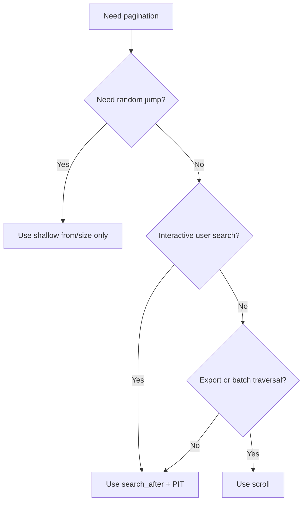

# Elasticsearch 深分页与结果遍历

这篇笔记整理 Elasticsearch 在分页上的真实约束：为什么 `from + size` 到深页会变重、什么时候该用 `search_after`、为什么 scroll 更适合导出，以及当前官方推荐里 PIT 的角色。

官方/来源：

- Paginate search results：<https://www.elastic.co/guide/en/elasticsearch/reference/current/paginate-search-results.html>
- Scroll API：<https://www.elastic.co/guide/en/elasticsearch/reference/current/scroll-api.html>
- raw source：[[../../../_kb/raw/Elasticsearch Notion 导出来源记录]]

[TOC]

## 目录

- [Key Takeaways](#key-takeaways)
- [为什么深分页会变慢](#为什么深分页会变慢)
- [from/size 的适用边界](#fromsize-的适用边界)
- [search_after 与 PIT](#search_after-与-pit)
- [scroll 的真实定位](#scroll-的真实定位)
- [选型建议](#选型建议)
- [最佳实践](#最佳实践)
- [Architecture or Flow](#architecture-or-flow)
- [Related Pages](#related-pages)
- [参考来源](#参考来源)

## Key Takeaways

- 深分页的代价不是“只多取几页”，而是每个分片都要为更深的位置准备候选结果，再由协调节点做全局归并。
- `from/size` 适合浅分页，不适合无限往后翻。
- 当前交互式深分页最佳实践优先 `search_after + PIT`。
- `scroll` 适合导出、遍历、批处理，不适合用户实时搜索分页。

## 为什么深分页会变慢

当你请求：

- `from = 990`
- `size = 10`

Elasticsearch 并不是“直接跳到第 991 条”。它通常要：

1. 每个分片先找出本分片前 `1000` 条候选
2. 协调节点汇总所有分片候选
3. 做全局排序
4. 丢掉前 `990` 条，只返回最后 `10` 条

因此代价大致跟下面这件事相关：

- `分片数 x (from + size)`

这既耗内存，也耗 CPU。

## from/size 的适用边界

### 适合

- 前几页列表
- 管理后台低深度分页
- 总结果量可控的搜索

### 不适合

- 上千页后继续翻页
- 大 shard 数跨分片排序
- 用户无限滚动但仍靠页码跳页

### 默认保护

原始来源提到的 `index.max_result_window = 10000` 本质上就是保护机制：

- 防止单请求过度消耗资源
- 限制浅分页范围

不要把“调大这个值”当成解决深分页的默认方案。

## search_after 与 PIT

### search_after 的本质

`search_after` 不是页码分页，而是“基于上一页最后一个排序值继续往后走”。

它要求：

- 排序规则稳定
- 排序字段唯一或组合唯一
- 只能顺序翻页，不能随机跳转

### 为什么要配 PIT

原始来源里重点讲了 `search_after`，这在思路上是对的。但当前官方实践更进一步，推荐把它和 `PIT` 配合使用。

原因：

- 不开 PIT 时，翻页过程中索引可能持续变化
- 新增、删除、刷新可能导致页间结果漂移
- PIT 可以为这一段查询提供更稳定的视图

因此，交互式深分页更稳的组合是：

- `search_after`
- `sort`
- `PIT`

### 适用场景

- 无限滚动
- 时间线类结果
- 大结果集顺序遍历
- 需要比 scroll 更实时的搜索分页

## scroll 的真实定位

scroll 的核心思想是：

- 创建一个查询快照上下文
- 后续通过 `scroll_id` 继续向后批量取数据

它的优势是：

- 不需要重复做深分页那种大规模跳转
- 适合一致性较强的顺序遍历

它的问题是：

- 占用服务端上下文资源
- 不适合实时用户搜索
- 生命周期需要显式管理与清理

### scroll 更适合

- 数据导出
- 离线批处理
- 全量扫描
- 迁移与归档

### scroll 不适合

- 用户在 UI 上一页页翻搜索结果
- 高并发实时检索主链路

## 选型建议

| 场景 | 推荐方案 | 原因 |
| --- | --- | --- |
| 前几页搜索 | `from/size` | 简单直接 |
| 无限滚动 | `search_after + PIT` | 资源可控且更符合交互 |
| 导出全量数据 | `scroll` | 快照遍历更稳定 |
| 任意跳到第 N 页 | 业务重构 | ES 不擅长高效随机深跳 |

## 最佳实践

- 对用户产品，优先把页码思维改成“滚动加载 + 筛选收窄”。
- `search_after` 的排序字段必须唯一或组合唯一，常见做法是“业务时间字段 + `_id`”。
- scroll 用完就清理，不要让上下文悬挂。
- 不要通过无限调大 `max_result_window` 掩盖产品与架构问题。

## Architecture or Flow

## Related Pages

- [[Elasticsearch 阅读指南]]
- [[Elasticsearch 知识索引]]
- [[Elasticsearch 检索原理、NRT 与相关性评分]]
- [[Elasticsearch 集群与分布式架构]]
- [[../../../_kb/raw/Elasticsearch Notion 导出来源记录]]

## 参考来源

- Paginate search results：<https://www.elastic.co/guide/en/elasticsearch/reference/current/paginate-search-results.html>
- Scroll API：<https://www.elastic.co/guide/en/elasticsearch/reference/current/scroll-api.html>
- raw source：[[../../../_kb/raw/Elasticsearch Notion 导出来源记录]]
