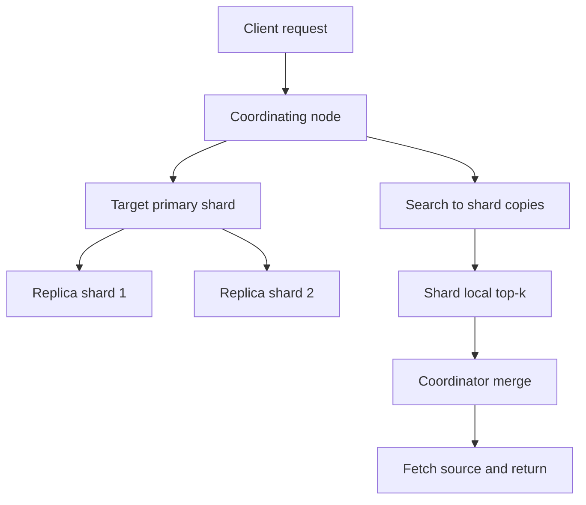

# Elasticsearch 集群与分布式架构

这篇笔记整理 Elasticsearch 在集群层面的核心设计：节点怎么分工、写入与搜索如何在分片上路由、故障转移如何发生，以及当前版本下更推荐的角色配置方式。

官方/来源：

- Node settings and roles：<https://www.elastic.co/guide/en/elasticsearch/reference/current/modules-node.html>
- raw source：[[../../../_kb/raw/Elasticsearch Notion 导出来源记录]]

[TOC]

## 目录

- [Key Takeaways](#key-takeaways)
- [为什么需要集群](#为什么需要集群)
- [节点角色](#节点角色)
- [分片与副本](#分片与副本)
- [写入、读取与搜索路由](#写入读取与搜索路由)
- [故障转移与恢复](#故障转移与恢复)
- [监控与健康治理](#监控与健康治理)
- [最佳实践](#最佳实践)
- [Architecture or Flow](#architecture-or-flow)
- [Related Pages](#related-pages)
- [参考来源](#参考来源)

## Key Takeaways

- 集群的目标不是“把单机部署复制几份”，而是同时解决容量、吞吐和高可用。
- 索引的主分片数决定了水平切分方式，副本数决定了读扩展和容灾能力。
- 新版集群角色更推荐使用 `node.roles`，而不是旧式 `node.master/node.data/node.ingest` 布尔配置。
- 查询压力、写入压力和控制面压力在大集群里应尽量分层治理。

## 为什么需要集群

单机 Elasticsearch 容易在四类问题上触顶：

- 容量上限
- 查询吞吐
- 单点故障
- 维护窗口风险

集群通过“多节点 + 分片 + 副本”把这几个问题拆开治理。

## 节点角色

### 角色职责

- `master-eligible`：维护集群状态、分片分配、元数据更新
- `data`：存储分片并处理索引 / 搜索请求
- `ingest`：执行 ingest pipeline
- `coordinating`：接收请求、分发到数据节点、聚合结果

### 现代配置方式

当前更推荐：

```yaml
node.roles: [ master, data_hot, ingest ]
```

而不是历史上的：

```yaml
node.master: true
node.data: true
node.ingest: true
```

### 规模化时的典型分工

- 小集群：一个节点兼多角色
- 中大型集群：
  - 专职 master 节点
  - 承压 data 节点
  - 必要时独立 ingest 或 coordinating 节点

## 分片与副本

### 主分片

- 决定索引的水平切分粒度
- 创建后不应随意理解为可原地变更
- 过多分片会带来元数据、内存和调度成本

### 副本分片

- 提供高可用
- 承担一部分读流量
- 数量可以按可用性和吞吐需求调整

### 一个关键事实

主分片和其副本分片不应落在同一节点上，否则没有容灾意义。

## 写入、读取与搜索路由

### 写入

1. 客户端把请求发到任一节点
2. 该节点临时充当协调节点
3. 根据路由规则把写入送到目标主分片
4. 主分片写入后复制到副本
5. 完成后响应客户端

### 按 ID 读取

- 协调节点根据文档 ID 路由到目标分片
- 实际读取可由主分片或副本分片承接

### 搜索

- 广播到相关分片
- 每个分片先算本地 top-k
- 协调节点全局归并后回查文档

这解释了为什么排序、深分页、跨索引搜索都对协调节点有压力。

## 故障转移与恢复

### 节点故障时会发生什么

- master 检测节点失联
- 对应分片状态被更新
- 如果主分片失联，而副本可用，则可提升副本为新的主分片
- 集群随后尝试补齐新的副本并重新平衡

### 恢复时要关注什么

- shard relocation 是否过多
- network 和 disk 是否是瓶颈
- 恢复过程是否与业务高峰冲突

## 监控与健康治理

原始来源整理了很多 `_cat` API，这些非常实用。常用观测面包括：

- `/_cat/health`
- `/_cat/nodes`
- `/_cat/indices`
- `/_cat/shards`
- `/_cat/allocation`
- `/_cluster/stats`

### 健康状态直觉

- `green`：主分片和副本都正常
- `yellow`：主分片正常，但至少有副本缺失
- `red`：至少有主分片不可用

单节点集群在有副本配置时常见 `yellow`，这并不等于马上不可用，但说明副本没有真正落地。

## 最佳实践

- 新集群优先用 `node.roles` 设计职责，而不是沿用旧版布尔角色配置。
- 不要把“多分片”误解为“性能一定更高”；分片过多本身有成本。
- dedicated master 节点不应承受重查询和大批量写入。
- 监控不只看 `green/yellow/red`，还要看 heap、CPU、磁盘、relocation、pending tasks。

## Architecture or Flow



## Related Pages

- [[Elasticsearch 阅读指南]]
- [[Elasticsearch 知识索引]]
- [[Elasticsearch 检索原理、NRT 与相关性评分]]
- [[Elasticsearch 数据同步、别名与重建索引]]
- [[../../../_kb/raw/Elasticsearch Notion 导出来源记录]]

## 参考来源

- Node settings and roles：<https://www.elastic.co/guide/en/elasticsearch/reference/current/modules-node.html>
- raw source：[[../../../_kb/raw/Elasticsearch Notion 导出来源记录]]
