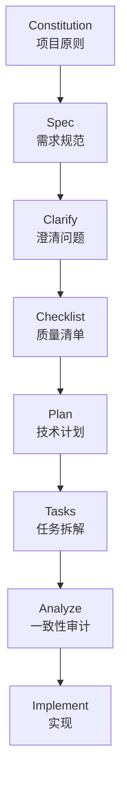
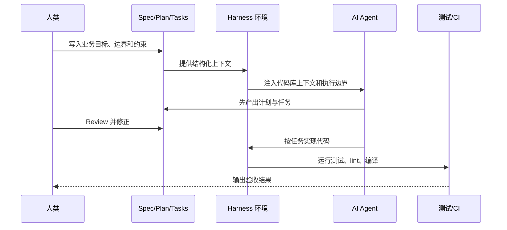

# Spec Kit 与 SDD 规范驱动开发实践指南

Spec Kit 是 GitHub 开源的 SDD（Spec-Driven Development，规范驱动开发）工具包。它的核心价值不是替你直接写代码，而是把 AI coding 从“模糊提示词驱动”推进到“规范、计划、任务和实现逐层约束”的工程流程。

> 核对时间：2026-06-03。本文以 GitHub 官方 `github/spec-kit` 仓库和官方文档为准；你提供的实践材料中有些命令或目录名来自经验总结或旧版本，本文已标注需要确认的地方。

## 目录

- [Key Takeaways](#key-takeaways)
- [SDD 是什么](#sdd-是什么)
- [Spec Kit 的核心链路](#spec-kit-的核心链路)
- [SDD 与 Harness 的关系](#sdd-与-harness-的关系)
- [Spec Kit 与 OpenSpec 的定位对比](#spec-kit-与-openspec-的定位对比)
- [安装与初始化](#安装与初始化)
- [Agent 选择与集成策略](#agent-选择与集成策略)
- [官方 Slash Commands 详表](#官方-slash-commands-详表)
- [Specify CLI 命令详表](#specify-cli-命令详表)
- [标准工作流](#标准工作流)
- [新项目开荒实践](#新项目开荒实践)
- [老项目迭代实践](#老项目迭代实践)
- [大型重构通关顺序](#大型重构通关顺序)
- [需求变更与纠错姿势](#需求变更与纠错姿势)
- [Spec 模板](#spec-模板)
- [Mac 常见问题](#mac-常见问题)
- [落地检查清单](#落地检查清单)
- [参考来源](#参考来源)

## Key Takeaways

- SDD 的主线是：`Constitution -> Spec -> Plan -> Tasks -> Implement`。
- Spec 是跨 Agent 通用的。Spec Kit 只是把这套流程落到具体 agent、目录、命令和模板上。
- 官方当前目录是 `.specify/`，不是 `.speckit/`。如果看到 `.speckit/`，需要确认是不是旧版本、第三方包装或口误。
- 官方推荐从 `github/spec-kit` 通过 `uv tool install`、`uvx` 或 `pipx` 安装；不要把 PyPI 上同名包当官方包。
- 日常主干命令是 `/speckit.constitution`、`/speckit.specify`、`/speckit.plan`、`/speckit.tasks`、`/speckit.implement`。
- 生产级功能建议把 `/speckit.clarify`、`/speckit.checklist`、`/speckit.analyze` 当作质量闸门。
- Codex CLI 是 skills-based 集成，官方说明中调用形式是 `$speckit-<command>`；多数其他 agent 使用 `/speckit.*` 斜杠命令。
- 你材料里提到的 `/speckit.rollback`、`/speckit.diagnose`、`/speckit.archive` 未在官方核心命令中核实到，可能来自扩展、第三方工作流或非官方实践，使用前先跑 `specify extension list` 和 `specify version --features` 确认。

## SDD 是什么

SDD 是 Spec-Driven Development，规范驱动开发。它把“要构建什么”写成可评审、可追踪、可被 AI agent 消化的规范，再由规范派生技术计划、任务清单、代码和测试。

与传统 prompt engineering 的区别：

| 维度 | Prompt Engineering | SDD |
| --- | --- | --- |
| 输入形态 | 一段临时自然语言 | 结构化 Spec、Plan、Tasks |
| 真理源 | 当前对话上下文 | 版本化规范文档 |
| AI 行为 | 直接生成代码 | 先产出可评审工件，再实现 |
| 人类控制点 | 主要在代码生成后 review | 在 Spec、Plan、Tasks、Implement 多阶段卡点 |
| 适合场景 | 小片段代码、一次性任务 | 多文件、多角色、多人协作、复杂业务系统 |

### SDD 为什么适合 AI Coding

AI agent 容易在三种情况下翻车：

- 需求模糊：它会补全自己以为合理的业务规则。
- 上下文过长：它会忘记前面已经确认过的约束。
- 代码库复杂：它可能误改公共类、老接口、历史兼容逻辑。

SDD 的做法是把这些风险前置到文档阶段：

- 用 `Spec` 写清楚业务目标、边界、输入输出、异常和非目标。
- 用 `Plan` 写清楚技术路线、架构选择、文件范围和依赖。
- 用 `Tasks` 把执行拆成可逐项验收的小任务。
- 用 `Analyze` 检查 Spec、Plan、Tasks 之间是否互相矛盾。

## Spec Kit 的核心链路

官方核心流程可以简化为：



极简实验可以走：

```text
/speckit.specify -> /speckit.plan -> /speckit.tasks -> /speckit.implement
```

正式功能建议走：

```text
/speckit.constitution
-> /speckit.specify
-> /speckit.clarify
-> /speckit.checklist
-> /speckit.plan
-> /speckit.tasks
-> /speckit.analyze
-> /speckit.implement
```

## SDD 与 Harness 的关系

SDD 和 Harness 不是竞争关系，而是上下层关系：

| 层次 | 解决的问题 | 典型产物 |
| --- | --- | --- |
| SDD | AI 应该依据什么写代码 | `constitution.md`、`spec.md`、`plan.md`、`tasks.md` |
| Harness | AI 在什么环境里执行、验证、回滚和受控 | 沙箱、Repo Map、Linter、测试脚本、Git hooks、CI |

结合方式：



关联笔记：[[AI Agent 的 Harness Engineering]]

## Spec Kit 与 OpenSpec 的定位对比

下面对比以你提供的学习材料为基础，OpenSpec 细节未在本次官方源中逐项核对，使用前需确认对应版本文档。

| 维度 | Spec Kit | OpenSpec | 纯提示词 |
| --- | --- | --- | --- |
| 工具定位 | 系统化 SDD 工具包 | 轻量、增量式 SDD 框架 | 无工具约束 |
| 工作流 | `Constitution -> Specify -> Clarify -> Plan -> Tasks -> Analyze -> Implement` | `Propose -> Apply -> Archive`，需确认版本 | 直接聊天生成 |
| 更适合 | 新项目开荒、企业规范、多人协作、严肃工程 | 老项目迭代、小步增量、个人或小团队 | 单文件、小脚本、临时探索 |
| 优势 | 官方生态、30+ agent 集成、模板/扩展/工作流完整 | 手感轻、增量规范友好 | 启动最快 |
| 风险 | 流程较重，需要维护文档资产 | 多人冲突和版本治理需确认 | 容易幻觉、遗漏、漂移 |

## 安装与初始化

### 前置依赖

| 依赖 | 用途 | 检查命令 | 备注 |
| --- | --- | --- | --- |
| Git | 分支、spec 目录、版本管理 | `git --version` | 必需 |
| Python 3.11+ | `specify` CLI 运行环境 | `python3 --version` | 官方要求 |
| uv | 官方推荐安装方式 | `uv --version` | 推荐 |
| AI coding agent | 执行 Spec Kit 命令 | `specify integration list` | Codex、opencode、Claude、Copilot 等 |

### 安装 uv

macOS 推荐：

```bash
brew install uv
uv --version
```

也可以用 uv 官方安装脚本：

```bash
curl -LsSf https://astral.sh/uv/install.sh | sh
uv --version
```

### 持久安装 Specify CLI

官方推荐从 GitHub 仓库安装，并固定 release tag：

```bash
uv tool install specify-cli --from git+https://github.com/github/spec-kit.git@vX.Y.Z
specify version
```

说明：

- `vX.Y.Z` 应替换成 GitHub Releases 里的具体版本号。
- 官方提醒：PyPI 上同名 `specify-cli` 包不是 Spec Kit 官方维护包。

### 一次性运行

不想全局安装时可以用：

```bash
uvx --from git+https://github.com/github/spec-kit.git@vX.Y.Z specify init <PROJECT_NAME>
```

初始化当前目录：

```bash
uvx --from git+https://github.com/github/spec-kit.git@vX.Y.Z specify init .
```

### 初始化项目

新项目：

```bash
specify init my-project --integration copilot --script sh
cd my-project
```

已有项目：

```bash
specify init . --integration opencode --script sh
```

如果当前目录非空，官方示例使用：

```bash
specify init --here --force --integration copilot
```

或：

```bash
specify init . --force --integration opencode --script sh
```

### 初始化后目录

官方当前目录是 `.specify/`：

```text
.specify/
  memory/
    constitution.md
  scripts/
    bash/
      check-prerequisites.sh
      common.sh
      create-new-feature.sh
      setup-plan.sh
      setup-tasks.sh
  templates/
    plan-template.md
    spec-template.md
    tasks-template.md
specs/
```

注意：

- 你材料中提到的 `.speckit/` 需要确认版本或来源。
- 官方 README 示例和安装文档主要使用 `.specify/`。

## Agent 选择与集成策略

### 常见选择

| Agent / 集成 | integration key | 适合场景 | 注意点 |
| --- | --- | --- | --- |
| GitHub Copilot | `copilot` | GitHub / VS Code / 企业协作 | 非交互默认可能选择 Copilot，显式传 `--integration` 更稳 |
| Claude Code | `claude` | 强推理、多步工程任务 | skills-based 集成，安装到 `.claude/skills` |
| Codex CLI | `codex` | 终端单兵、CLI 工作流 | 官方说明为 skills-based，安装到 `.agents/skills`，调用 `$speckit-<command>` |
| opencode | `opencode` | 开放底座、多 Agent、团队实践 | 支持，但是否多集成安全需以 `specify integration list` 为准 |
| Cursor | `cursor-agent` | IDE 内对话和编辑 | IDE agent 不一定需要本地 CLI |
| generic | `generic` | 自带 agent 或非官方 agent | 需要传 `--integration-options="--commands-dir <path>"` |

### 初始化时显式选择

```bash
specify init . --integration codex --script sh
specify init . --integration opencode --script sh
specify init . --integration generic --integration-options="--commands-dir .myagent/cmds" --script sh
```

### 管理集成

| 目标 | 命令 | 说明 |
| --- | --- | --- |
| 查看支持的 agent | `specify integration list` | 显示可用 integration、当前默认项、CLI/IDE 类型 |
| 安装另一个集成 | `specify integration install <key>` | 已初始化项目内使用 |
| 切换默认集成 | `specify integration use <key>` | 不卸载其他集成 |
| 替换集成 | `specify integration switch <key>` | 类似卸载旧默认再装新默认 |
| 升级集成文件 | `specify integration upgrade [<key>]` | CLI 升级后刷新模板/命令 |
| 卸载集成 | `specify integration uninstall [<key>]` | 未改动文件自动移除，改动文件默认保留 |

## 官方 Slash Commands 详表

### 核心命令

| 命令                       | Skill 名                 | 阶段                   | 作用                     | 输入重点                 | 产物                                | 人类 Review 点                 |
| ------------------------ | ----------------------- | -------------------- | ---------------------- | -------------------- | --------------------------------- | --------------------------- |
| `/speckit.constitution`  | `speckit-constitution`  | 准备期                  | 创建或更新项目治理原则            | 技术栈底线、测试标准、安全要求、架构禁区 | `.specify/memory/constitution.md` | 原则是否长期有效，是否过度细节化            |
| `/speckit.specify`       | `speckit-specify`       | 需求期                  | 定义要构建什么                | 业务目标、用户故事、输入输出、非目标   | feature 目录下的 `spec.md`            | 是否只写 what/why，是否混入太多 how    |
| `/speckit.clarify`       | `speckit-clarify`       | `specify` 后、`plan` 前 | 盘问需求中的模糊、冲突和风险点        | 老项目、复杂业务、边界多的需求      | 把它的问题当作需求评审清单                     |                             |
| `/speckit.plan`          | `speckit-plan`          | 设计期                  | 生成技术实现计划               | 技术栈、架构约束、文件范围、依赖     | `plan.md`                         | 架构是否合理，是否误改老系统边界            |
| `/speckit.tasks`         | `speckit-tasks`         | 拆解期                  | 生成可执行任务列表              | 已评审的 spec 和 plan     | `tasks.md`                        | 任务是否足够小，是否测试先行              |
| `/speckit.taskstoissues` | `speckit-taskstoissues` | 跟踪期                  | 把任务清单转换成 GitHub Issues | 已生成的 `tasks.md`      | GitHub issues                     | 是否适合团队协作，是否需要 MCP/GitHub 支持 |
| `/speckit.implement`     | `speckit-implement`     | 编码期                  | 按任务执行实现                | `tasks.md`、上下文、测试脚本  | 代码、测试、任务完成状态                      | 是否允许 agent 执行命令，是否要分批放行     |

### 可选质量命令

| 命令                   | Skill 名             | 建议时机                    | 作用                        | 适合场景                | 输出怎么看                         |
| -------------------- | ------------------- | ----------------------- | ------------------------- | ------------------- | ----------------------------- |
| `/speckit.checklist` | `speckit-checklist` | `clarify` 后或 `plan` 前后  | 生成需求完整性、清晰度和一致性清单         | 生产功能、多人协作、PR review | 未通过项要回写 Spec 或 Plan           |
| `/speckit.analyze`   | `speckit-analyze`   | `tasks` 后、`implement` 前 | 检查 Spec、Plan、Tasks 跨资产一致性 | 防止任务偏离需求或计划         | 阻断 critical mismatch，先修文档再写代码 |

### 未核实的命令

| 命令 | 当前状态 | 使用建议 |
| --- | --- | --- |
| `/speckit.rollback` | 未在官方核心命令核实到 | 可能来自扩展或第三方工作流；先查 `specify extension list` |
| `/speckit.diagnose` | 未在官方核心命令核实到 | 可能来自扩展；不要写进团队标准流程前先验证 |
| `/speckit.archive` | 未在官方核心命令核实到 | OpenSpec 有 archive 概念；Spec Kit 是否支持需以本地功能为准 |

确认方式：

```bash
specify version --features
specify extension list
specify workflow list
```

## Specify CLI 命令详表

### 初始化、检查、版本

| 命令 | 作用 | 常用场景 | 示例 |
| --- | --- | --- | --- |
| `specify init <project>` | 初始化新项目 | 从零开项目 | `specify init my-app --integration copilot --script sh` |
| `specify init .` | 初始化当前目录 | 老项目接入 | `specify init . --integration opencode --script sh` |
| `specify init --here` | 当前目录初始化 | 等价于当前目录语义 | `specify init --here --integration codex` |
| `specify init --here --force` | 强制合并到非空目录 | 已有项目中刷新模板 | `specify init --here --force --integration copilot` |
| `specify init --no-git` | 跳过 Git 初始化 | 非 Git 项目或特殊仓库 | `specify init my-app --no-git` |
| `specify init --ignore-agent-tools` | 跳过 agent 工具检查 | 只想拿模板或 agent 不在 PATH | `specify init . --integration claude --ignore-agent-tools` |
| `specify check` | 检查本地工具 | 出问题首选 | `specify check` |
| `specify version` | 查看版本和平台 | 确认是否官方版本 | `specify version` |
| `specify --version` / `specify -V` | 快速版本 | 脚本或日常查看 | `specify --version` |
| `specify version --features` | 查看本地功能能力 | 判断是否有新命令/功能 | `specify version --features --json` |
| `specify self check` | 检查是否落后最新版 | 命令表现像旧版本时 | `specify self check` |

### 集成管理

| 命令 | 作用 | 使用时机 | 注意 |
| --- | --- | --- | --- |
| `specify integration list` | 列出支持的 agent | 初始化前后都常用 | 看 key、默认集成、是否需要 CLI |
| `specify integration install <key>` | 增加一个 agent 集成 | 团队里多个 agent 共用项目 | 需要已初始化项目 |
| `specify integration use <key>` | 切默认集成 | 多集成项目中换默认 agent | 不卸载其他集成 |
| `specify integration switch <key>` | 替换或切换集成 | 从 opencode 改到 codex 等 | 修改过的文件默认会保护 |
| `specify integration upgrade [<key>]` | 刷新集成模板 | CLI 升级后 | 有本地改动可能被阻止 |
| `specify integration uninstall [<key>]` | 卸载集成 | 清理 agent 文件 | `--force` 会删除改动文件，谨慎 |

### 扩展 Extensions

| 命令 | 作用 | 典型用途 |
| --- | --- | --- |
| `specify extension search [query]` | 搜索扩展 | 找 git、CI、架构治理、质量门扩展 |
| `specify extension add <name>` | 安装扩展 | 增加新命令、hooks、质量门 |
| `specify extension list` | 列已安装扩展 | 排查某命令是否来自扩展 |
| `specify extension info <name>` | 查看扩展详情 | 安装前 review |
| `specify extension update [<name>]` | 更新扩展 | 更新单个或全部扩展 |
| `specify extension enable <name>` | 启用扩展 | 临时恢复 |
| `specify extension disable <name>` | 禁用扩展 | 临时停用高风险扩展 |
| `specify extension remove <name>` | 删除扩展 | 清理不用的命令 |
| `specify extension set-priority <name> <priority>` | 设置优先级 | 多扩展命令冲突时 |
| `specify extension catalog list` | 查看扩展目录 | 企业内控 |
| `specify extension catalog add <url>` | 添加扩展目录 | 接入公司批准目录 |
| `specify extension catalog remove <name>` | 移除扩展目录 | 清理不可信来源 |

重要边界：

- 扩展可能来自社区。安装前看源码和维护者。
- 团队项目应限制 extension catalog，避免每个人装不同命令导致流程漂移。

### Presets

| 命令 | 作用 | 适合场景 |
| --- | --- | --- |
| `specify preset search` | 搜索 preset | 找合规、DDD、行业模板 |
| `specify preset add <preset-name>` | 安装 preset | 定制 Spec/Plan/Tasks 格式 |
| `specify preset list` | 查看已安装 preset | 排查模板来源 |
| `specify preset remove <preset-name>` | 移除 preset | 回到默认模板 |

Preset 与 extension 的区别：

| 目标 | 应该用 |
| --- | --- |
| 新增命令、hooks、外部工具集成 | Extension |
| 改 Spec/Plan/Tasks 模板格式 | Preset |
| 加质量门、CI、审计能力 | Extension |
| 强制公司术语、合规模板、DDD 模板 | Preset |

### Workflows

| 命令 | 作用 | 示例 |
| --- | --- | --- |
| `specify workflow run <source>` | 运行工作流 | `specify workflow run speckit -i spec="Build a kanban board"` |
| `specify workflow resume <run_id>` | 从暂停/失败处恢复 | `specify workflow resume <run_id>` |
| `specify workflow status [run_id]` | 查看状态 | `specify workflow status` |
| `specify workflow list` | 列已安装工作流 | `specify workflow list` |
| `specify workflow add <source>` | 安装工作流 | `specify workflow add <url-or-local-file>` |
| `specify workflow remove <workflow_id>` | 移除工作流 | `specify workflow remove speckit` |
| `specify workflow search [query]` | 搜索工作流 | `specify workflow search brownfield` |
| `specify workflow info <workflow_id>` | 查看详情 | `specify workflow info speckit` |
| `specify workflow catalog list` | 查看工作流目录 | 企业目录治理 |
| `specify workflow catalog add <url>` | 添加目录 | 接入内部 workflow catalog |
| `specify workflow catalog remove <index>` | 移除目录 | 清理目录 |

官方内置 full SDD cycle 工作流会串起：

```text
specify -> review-spec gate -> plan -> review-plan gate -> tasks -> implement
```

## 标准工作流

### 轻量实验

适合小 demo、验证想法：

| 步骤 | 命令 | 人类动作 |
| --- | --- | --- |
| 1 | `/speckit.specify` | 写清楚想做什么和为什么 |
| 2 | `/speckit.plan` | 指定技术栈，快速 review |
| 3 | `/speckit.tasks` | 看任务是否足够小 |
| 4 | `/speckit.implement` | 允许执行，观察输出 |

### 生产功能

| 步骤 | 命令 | 人类动作 | 不通过时怎么办 |
| --- | --- | --- | --- |
| 1 | `/speckit.constitution` | 检查工程底线 | 改 constitution |
| 2 | `/speckit.specify` | 检查业务目标和非目标 | 改 spec |
| 3 | `/speckit.clarify` | 回答 AI 的风险问题 | 把答案回写 spec |
| 4 | `/speckit.checklist` | 检查是否缺需求项 | 补 spec 或 checklist |
| 5 | `/speckit.plan` | Review 技术设计 | 改 plan 或要求重做 |
| 6 | `/speckit.tasks` | Review 执行粒度 | 拆小任务 |
| 7 | `/speckit.analyze` | 看一致性报告 | 修 Spec/Plan/Tasks |
| 8 | `/speckit.implement` | 执行编码 | 出错先诊断，必要时回滚到 Git 检查点 |

## 新项目开荒实践

新项目最容易的问题是技术栈跑偏、过度设计、脚手架凌乱。重点卡在 constitution 和 plan。

| 阶段 | 命令 | 输入范例 | Review 重点 |
| --- | --- | --- | --- |
| 建立宪法 | `/speckit.constitution` | `这是 Spring Boot 3.3 + JDK 21 后端项目，必须遵循 DDD，Controller 禁止写业务逻辑，单元测试覆盖率不低于 80%。` | 技术栈、分层、测试、安全底线是否长期有效 |
| 写 Spec | `/speckit.specify` | `实现理赔单初始化 API，校验用户 ID 和保单合法性，初始状态为 DRAFT。` | 是否写清业务终态、输入输出、非目标 |
| 生成 Plan | `/speckit.plan` | `采用 MyBatis-Plus，状态流转使用 COLA StateMachine，接口遵循 RESTful。` | 包结构、领域模型、状态机、数据库设计 |
| 拆 Tasks | `/speckit.tasks` | 无需额外输入 | 是否先测试后实现，是否可以分阶段验收 |
| 实现 | `/speckit.implement` | 无需额外输入 | 是否按任务顺序改，是否跑测试 |

新项目 constitution 模板：

```text
/speckit.constitution
这是一个全新后端项目。
技术栈：JDK 21、Spring Boot 3.3、MyBatis-Plus。
架构：采用 DDD 分层，Controller 只做参数接收和响应组装，业务逻辑必须在 Application/Domain 层。
测试：核心业务必须写 JUnit 5 单元测试，覆盖成功、失败、边界和异常场景。
依赖：禁止引入未经授权的第三方依赖。
安全：任何外部调用必须有超时、重试边界和日志。
```

## 老项目迭代实践

老项目最容易的问题是误改历史代码、破坏兼容性、遗漏边缘逻辑。重点卡在 specify、clarify、tasks。

| 阶段 | 命令 | 输入范例 | Review 重点 |
| --- | --- | --- | --- |
| 宪法补充 | `/speckit.constitution` | `这是运行 3 年的老系统，禁止修改 common-utils，数据库操作必须沿用现有 Mapper。` | 禁区是否明确 |
| Delta Spec | `/speckit.specify` | `在现有理赔流程中追加 TPA 审核阶段，只允许改 ClaimServiceImpl、TPAClient、ClaimStatusEnum。` | 文件范围、老逻辑兼容、非目标 |
| 风险盘问 | `/speckit.clarify` | 无需额外输入 | AI 提问是否击中历史包袱 |
| 任务拆解 | `/speckit.tasks` | 无需额外输入 | 是否小步，是否先加保护性测试 |
| 一致性审计 | `/speckit.analyze` | 无需额外输入 | 是否违背非目标或宪法 |
| 实现 | `/speckit.implement` | 无需额外输入 | 是否按任务逐步完成 |

老项目 Spec 模板：

```text
/speckit.specify
目标：在现有理赔流程中追加“第三方 TPA 审核”阶段。

依赖上下文：
- 现有领域模型：ClaimOrder
- 现有状态字段：status
- 现有第三方分派器：TpaDispatchService

允许修改范围：
- ClaimServiceImpl
- TpaDispatchService
- ClaimStatusEnum
- 对应单元测试

硬性业务约束：
- 只有 UNDER_REVIEW 状态允许触发 TPA_AUDIT。
- 调用第三方 TPA 失败时必须记录失败原因。
- 不得改变已有结案流程。

非目标：
- 本次不处理重试 3 次均失败后的降级逻辑。
- 本次不改数据库表结构。
```

## 大型重构通关顺序

大型重构不能让 AI 一口气写完。正确做法是逐层卡点。

| 战役 | 步骤 | 命令 | AI 应产出 | 人类卡点 |
| --- | --- | --- | --- | --- |
| 底线防御 | 1 | `/speckit.constitution` | 全局工程底线 | 明确禁止改哪些公共类、底层依赖和数据库结构 |
| 契约输入 | 2 | `/speckit.specify` | 重构 spec | 写清重构前后行为不变项、允许改动范围 |
| 契约输入 | 3 | `/speckit.clarify` | 风险问题清单 | 认真回答历史兼容、边界状态、失败处理 |
| 推演沙盘 | 4 | `/speckit.plan` | 技术计划 | 如果 AI 想大改数据库或绕开现有框架，立即打回 |
| 推演沙盘 | 5 | `/speckit.checklist` | 自检清单 | 看是否覆盖并发、空值、兼容、回归 |
| 拆弹执行 | 6 | `/speckit.tasks` | 原子任务看板 | 确保顺序是测试、适配、新逻辑、迁移、清理 |
| 拆弹执行 | 7 | `/speckit.analyze` | 一致性审计 | critical 问题必须先修文档 |
| 拆弹执行 | 8 | `/speckit.implement` | 代码和测试 | 分批允许，不要一次放行太多任务 |
| 合并收尾 | 9 | 人工 PR / CI | PR 和验证结果 | 以 Git/CI 为准，不要只信 agent 自述 |

如果需要 rollback/diagnose/archive：

- 优先使用 Git 自身检查点、分支和 PR。
- 如果本地 agent 显示这些 `/speckit.*` 命令可用，先确认它来自哪个 extension 或 workflow。
- 不要把未核实命令写进团队强制规范。

## 需求变更与纠错姿势

### 写代码前发现问题

| 问题发生阶段 | 正确修正方式 | 重新执行 | 原因 |
| --- | --- | --- | --- |
| Spec 阶段 | 改 `spec.md` 或让 AI 更新 Spec | `/speckit.specify` 或继续 clarify | 需求真理源先变 |
| Plan 阶段 | 改 `plan.md` 或要求重写 Plan | `/speckit.plan` | 技术方案要重新对齐需求 |
| Tasks 阶段 | 改 `tasks.md` 或要求拆小任务 | `/speckit.tasks` | 实现路线要重新生成 |
| Analyze 阶段 | 按报告修 Spec/Plan/Tasks | `/speckit.analyze` | 先消除矛盾再编码 |

### 写代码后发现问题

| 步骤 | 动作 | 命令/工具 | 说明 |
| --- | --- | --- | --- |
| 1 | 止损 | Git diff、Git stash、Git branch、必要时人工回滚 | 不要让 AI 在坏状态上继续猜 |
| 2 | 修真理源 | 改 `spec.md` | 业务规则变更必须先改 Spec |
| 3 | 刷新计划 | `/speckit.plan` | 涉及设计变更时必须重跑 |
| 4 | 刷新任务 | `/speckit.tasks` | 新增任务和未完成任务重新排序 |
| 5 | 一致性审计 | `/speckit.analyze` | 防止旧任务和新规则冲突 |
| 6 | 重新履约 | `/speckit.implement` | 只让 AI 执行最新任务 |

核心铁律：

```text
需求变了 -> 改 Spec
设计变了 -> 改 Plan
执行路线变了 -> 改 Tasks
代码错了 -> 先判断是不是 Spec/Plan/Tasks 错
```

## Spec 模板

```markdown
# 规格说明：用户积分兑换 API

## 1. 业务上下文

- 依赖现有 `UserService` 和 `ScoreRepository`。
- 目标文件范围：
  - `internal/handler/score.go`
  - `internal/service/score_service.go`

## 2. 输入输出契约

| 项 | 内容 |
| --- | --- |
| Method | `POST` |
| Path | `/api/v1/score/redeem` |
| Request Body | `{ "user_id": "string", "item_id": "string" }` |
| Success Response | `201 Created` |
| Error Response | `400 Bad Request` |

## 3. 硬性业务约束

- [MUST] 扣减积分前必须使用分布式锁锁定 `user_id`。
- [MUST] 积分不足时必须返回错误码 `ERR_INSUFFICIENT_SCORE`，禁止继续执行。
- [MUST] 所有失败路径必须记录业务日志。

## 4. 非目标

- [OUT-OF-SCOPE] 本次迭代暂不考虑高并发下的库存扣减。
- [OUT-OF-SCOPE] 本次不接入 OAuth2。

## 5. 验证标准

- 必须通过 `Test_ScoreRedeem_Success`。
- 必须通过 `Test_ScoreRedeem_LowScore`。
- 必须覆盖重复请求、积分不足、用户不存在三个边界场景。
```

## Mac 常见问题

### `uvx` 找不到

```bash
brew install uv
uv --version
```

重新打开终端后再执行：

```bash
uvx --from git+https://github.com/github/spec-kit.git@vX.Y.Z specify init .
```

### `specify` 版本不对

```bash
which specify
specify version
specify self check
```

如果怀疑装到了非官方包，重新按官方 GitHub 仓库安装：

```bash
uv tool install specify-cli --force --from git+https://github.com/github/spec-kit.git@vX.Y.Z
specify version
```

### Homebrew `certifi` 软链接冲突

你材料里提到的 `brew link --overwrite certifi` 属于 Homebrew 依赖软链接冲突处理，不是 Spec Kit 官方主线安装步骤。

如果本机确实通过 Homebrew 安装某个工具时出现 `certifi` link 冲突，可按 Homebrew 日志建议处理：

```bash
brew link --overwrite certifi
```

然后再验证：

```bash
specify version
```

### 初始化后 agent 看不到命令

| 排查项 | 命令/动作 |
| --- | --- |
| 确认项目已初始化 | `ls -la .specify` |
| 确认集成 | `specify integration list` |
| 刷新集成 | `specify integration upgrade [<key>]` |
| 切换默认集成 | `specify integration use <key>` |
| 重启 agent | 关闭并重新打开 Codex/OpenCode/Claude/Cursor |
| Codex 特例 | 使用 `$speckit-<command>` 而不是 `/speckit.*`，以本地安装提示为准 |

### `.gitignore` 安全项

如果项目使用 opencode 或其他 agent，检查是否需要加入：

```gitignore
.opencode/
```

不要把包含 API key、agent 缓存、运行日志的本地目录提交进 Git。

## 落地检查清单

### 项目接入

- [ ] 已确认 `specify version` 输出正常。
- [ ] 已确认安装来源是 `github/spec-kit`。
- [ ] 已使用 `--integration <key>` 显式选择 agent。
- [ ] macOS 项目已使用 `--script sh` 或确认默认脚本为 Bash。
- [ ] 已检查 `.specify/` 目录生成。
- [ ] 已检查 `.gitignore` 中是否需要排除 agent 本地缓存。

### SDD 使用

- [ ] 先写 constitution，再做正式功能。
- [ ] Spec 写 what/why，不急着写技术方案。
- [ ] 明确写出 `OUT-OF-SCOPE`。
- [ ] 老项目必须写允许修改范围和禁止修改范围。
- [ ] Plan 必须人工 review。
- [ ] Tasks 必须足够原子化。
- [ ] Implement 前运行 `/speckit.analyze`。
- [ ] PR 中必须包含同步更新的 Spec/Plan/Tasks。

### 老项目防翻车

- [ ] 先让 AI 读现有代码和索引，不直接写代码。
- [ ] 先补保护性测试，再改业务逻辑。
- [ ] 单次任务只放行少量文件。
- [ ] 大型重构分阶段提交。
- [ ] 所有需求变更先改 Spec，再刷新 Plan/Tasks。

## 参考来源

- GitHub Spec Kit 官方仓库：<https://github.com/github/spec-kit>
- Spec Kit 安装指南：<https://github.github.com/spec-kit/installation.html>
- Spec Kit Quick Start：<https://github.github.com/spec-kit/quickstart.html>
- What is Spec-Driven Development：<https://github.github.com/spec-kit/concepts/sdd.html>
- Core Commands：<https://github.github.com/spec-kit/reference/core.html>
- Supported AI Coding Agent Integrations：<https://github.github.com/spec-kit/reference/integrations.html>
- Extensions Reference：<https://github.github.com/spec-kit/reference/extensions.html>
- Workflows Reference：<https://github.github.com/spec-kit/reference/workflows.html>
