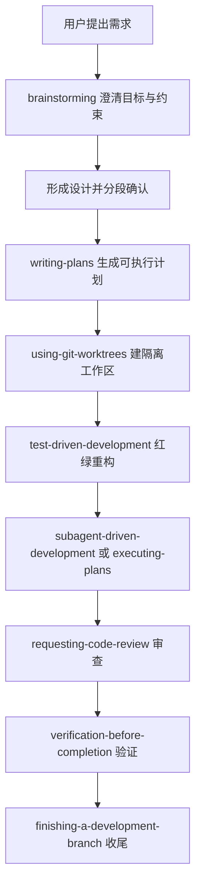

# Superpowers 安装使用与 AI 编程工作流实践指南

Superpowers 是 `obra/superpowers` 仓库提供的一套 agentic skills framework 和软件开发方法论。它的核心价值不是“多装几个提示词”，而是把需求澄清、设计评审、任务拆分、TDD、子代理执行、代码审查和收尾合并这些工程动作变成编码 Agent 会主动调用的 skills。

官方地址：

- GitHub：<https://github.com/obra/superpowers>
- OpenCode 文档：<https://github.com/obra/superpowers/blob/main/docs/README.opencode.md>
- 原始发布介绍：<https://blog.fsck.com/2025/10/09/superpowers/>

## 目录

- [Key Takeaways](#key-takeaways)
- [Superpowers 是什么](#superpowers-是什么)
- [它解决什么问题](#它解决什么问题)
- [核心 workflow](#核心-workflow)
- [内置 skills](#内置-skills)
- [macOS 全局安装建议](#macos-全局安装建议)
- [Claude Code 安装](#claude-code-安装)
- [Codex 安装](#codex-安装)
- [OpenCode 安装](#opencode-安装)
- [Hermes Agent 适配状态](#hermes-agent-适配状态)
- [如何使用](#如何使用)
- [真实工程实践命令实例](#真实工程实践命令实例)
- [简单需求工作流](#简单需求工作流)
- [复杂工程工作流](#复杂工程工作流)
- [更新、排障与安全](#更新排障与安全)
- [与本库相关笔记](#与本库相关笔记)
- [参考来源](#参考来源)

## Key Takeaways

- Superpowers 的定位是“编码 Agent 的工程方法论 + skills 集合”，不是单一 CLI。
- 它要求 Agent 在写代码前先澄清目标、形成设计、写计划，再进入实现。
- 它强调 `RED-GREEN-REFACTOR` TDD、YAGNI、DRY、证据优先和系统化调试。
- Claude Code、Codex、OpenCode 都有官方 README 中明确提到的安装路径，但需要分别安装；一个工具装好不等于其他工具可用。
- OpenCode 当前推荐使用 `opencode.json` 的 `plugin` 数组做全局或项目级安装。
- Hermes Agent 没有出现在 Superpowers 官方支持列表中；不要把它当成官方已适配。若要接入 Hermes，需要另做适配验证，本文标记为 `需确认`。

## Superpowers 是什么

一句话理解：

- `Superpowers = skills 化的软件开发流程框架 + 多编码 Agent 插件适配`

它把一套开发方法拆成多个可自动触发的 skills。典型流程是：



## 它解决什么问题

很多编码 Agent 的失败不是模型不会写代码，而是流程不稳定：

| 常见问题 | Superpowers 的约束 |
| --- | --- |
| 一上来就改代码 | 先 brainstorming，明确真实目标 |
| 需求口头化、不可验证 | 先写设计和计划 |
| 改动太大难审查 | 任务拆成小步骤，并带文件路径和验证方式 |
| 测试后补或不补 | 强制 TDD 的红绿重构 |
| Agent 自称完成但没验证 | verification-before-completion 要求用证据收尾 |
| 多任务互相污染 | using-git-worktrees 隔离分支 |
| 复杂任务上下文漂移 | subagent-driven-development 用子代理执行并审查 |

## 核心 workflow

官方 README 描述的基础工作流可以概括为：

1. `brainstorming`：写代码前触发，通过提问澄清目标、替代方案和约束，并保存设计文档。
2. `using-git-worktrees`：设计批准后创建隔离工作区，检查分支和测试基线。
3. `writing-plans`：把设计拆成小任务，每个任务包含路径、代码意图和验证步骤。
4. `subagent-driven-development` / `executing-plans`：按计划执行；复杂场景用子代理和两阶段审查。
5. `test-driven-development`：先写失败测试，再写最小实现，再重构。
6. `requesting-code-review`：任务之间做代码审查，严重问题阻塞继续推进。
7. `finishing-a-development-branch`：所有任务完成后验证测试，并决定 merge、PR、保留或丢弃 worktree。

## 内置 skills

| 类别 | skills | 用途 |
| --- | --- | --- |
| Testing | `test-driven-development` | 强制红绿重构 |
| Debugging | `systematic-debugging`, `verification-before-completion` | 根因分析、修复验证 |
| Collaboration | `brainstorming`, `writing-plans`, `executing-plans`, `requesting-code-review`, `receiving-code-review` | 需求澄清、计划、执行、审查 |
| Parallel / Branch | `using-git-worktrees`, `dispatching-parallel-agents`, `subagent-driven-development`, `finishing-a-development-branch` | 隔离工作区、并行任务、收尾 |
| Meta | `using-superpowers`, `writing-skills` | 引导 Agent 使用 skills、创建新 skills |

## macOS 全局安装建议

你当前关注的工具是 `codex`、`claude`、`opencode` 和 `hermes`。推荐策略：

| 工具 | 官方适配状态 | macOS 全局安装建议 |
| --- | --- | --- |
| Claude Code | 官方 README 明确支持 | 在 Claude Code 内通过官方 plugin marketplace 安装 |
| Codex App / CLI | 官方 README 明确支持 | 在 Codex App 插件页或 Codex CLI `/plugins` 中安装 |
| OpenCode | 官方 README 和专门文档明确支持 | 写入 `~/.config/opencode/opencode.json` 的 `plugin` 数组 |
| Hermes Agent | README 未列出 | `需确认`，不建议直接声明为官方支持；可后续单独验证 Hermes skills / plugin 机制 |

关键原则：

- 每个 harness 都要单独安装。
- 全局安装优先放用户级配置目录，不要复制到项目仓库。
- 项目级特殊规则仍应放在项目的 `AGENTS.md` 或对应工具的项目配置中。

## Claude Code 安装

Claude Code 有两条官方 README 提到的路径。

### 官方 marketplace

在 Claude Code 会话中执行：

```text
/plugin install superpowers@claude-plugins-official
```

### Superpowers marketplace

如果使用 Superpowers marketplace：

```text
/plugin marketplace add obra/superpowers-marketplace
/plugin install superpowers@superpowers-marketplace
```

验证方式：

```text
Tell me about your superpowers
```

期望结果：

- Agent 能说明已加载 Superpowers。
- 在开发类任务前会主动提到适用 skill，例如 `brainstorming`、`writing-plans`、`test-driven-development`。

## Codex 安装

官方 README 将 Codex App 和 Codex CLI 分开说明。

### Codex App

在 Codex App 中：

1. 打开侧边栏 `Plugins`。
2. 在 Coding 分类中找到 `Superpowers`。
3. 点击 `+` 并按提示安装。

### Codex CLI

在 Codex CLI 会话中打开插件搜索：

```text
/plugins
```

搜索：

```text
superpowers
```

选择 `Install Plugin`。

验证方式：

```text
Tell me about your superpowers
```

## OpenCode 安装

OpenCode 使用自己的 plugin 安装机制。官方文档强调：即使 Claude Code 或 Codex 已经安装过，OpenCode 仍然要单独安装。

全局配置路径：

```bash
mkdir -p ~/.config/opencode
$EDITOR ~/.config/opencode/opencode.json
```

加入或合并以下配置：

```json
{
  "plugin": ["superpowers@git+https://github.com/obra/superpowers.git"]
}
```

如果已经有其他插件，不要覆盖，合并到同一个数组：

```json
{
  "plugin": [
    "existing-plugin",
    "superpowers@git+https://github.com/obra/superpowers.git"
  ]
}
```

重启 OpenCode 后验证：

```text
Tell me about your superpowers
```

也可以让 OpenCode 使用原生 `skill` tool：

```text
use skill tool to list skills
use skill tool to load brainstorming
```

固定版本示例：

```json
{
  "plugin": ["superpowers@git+https://github.com/obra/superpowers.git#v5.0.3"]
}
```

## Hermes Agent 适配状态

截至本次整理，Superpowers 官方 README 的支持列表没有列出 Hermes Agent。

结论：

- `需确认`：Superpowers 是否已有 Hermes 官方 plugin / package。
- 不建议直接把 OpenCode 的 `plugin` 配置复制给 Hermes。
- 不建议把本文中的 Claude / Codex slash command 当成 Hermes 命令。

如果后续要做 Hermes 适配，建议单独走验证流程：

```bash
hermes --version
hermes config check
```

然后核对 Hermes 的 skills / plugin 文档，确认它是否能读取 Superpowers 的 `SKILL.md` 结构、是否支持会话启动注入、是否支持工具映射。没有验证前，只能把它当作待适配项。

## 如何使用

安装完成后，日常使用不是“记住每个 skill 名称”，而是让 Agent 在合适场景自动触发。你可以用更明确的提示来约束它。

### 通用启动提示

```text
Use Superpowers. Before editing code, identify the relevant skills, then follow the workflow.
```

中文也可以：

```text
使用 Superpowers。先判断应该加载哪些 skills，不要直接改代码；先澄清需求、写计划，再执行。
```

### 让 Agent 做需求澄清

```text
Use brainstorming to clarify this feature before implementation:
我要给现有项目增加 GitHub OAuth 登录。
```

### 让 Agent 写计划

```text
Use writing-plans to turn the approved design into an implementation plan.
Plan must include exact files, tests, and verification commands.
```

### 让 Agent 按 TDD 实现

```text
Use test-driven-development.
First write the failing test, run it and show the failure, then implement the minimum code, then rerun tests.
```

### 让 Agent 收尾

```text
Use verification-before-completion and finishing-a-development-branch.
Run the relevant tests, summarize changed files, and tell me whether this should be merged, PR'd, or kept as a worktree.
```

## 真实工程实践命令实例

下面的“命令”分两类：

- shell 命令：在 macOS 终端执行。
- agent 指令：在 Claude Code / Codex / OpenCode / Hermes 等会话里发送。

Hermes 相关示例只写通用 agent 指令，不假设 Hermes 已官方安装 Superpowers。

## 简单需求工作流

适合小 bug、小组件、小脚本、小文档更新。

### 示例 1：修一个后端接口 bug

进入项目：

```bash
cd ~/work/my-api
git status --short
```

在 Agent 里发送：

```text
Use Superpowers and systematic-debugging.
Bug: POST /api/orders occasionally returns 500 when discount_code is empty.
First reproduce or locate the failing path. Do not patch until you identify the root cause.
```

确认根因后继续：

```text
Use test-driven-development.
Add a regression test for empty discount_code, run it and show the failure, then implement the minimal fix.
Verification command should be: npm test -- orders
```

本地验证：

```bash
npm test -- orders
git diff --stat
git diff
```

收尾指令：

```text
Use verification-before-completion.
Confirm the regression test passes, summarize the changed files, and list any remaining risk.
```

### 示例 2：给 CLI 增加一个小参数

```bash
cd ~/work/my-cli
git switch -c feat/add-json-output
```

Agent 指令：

```text
Use Superpowers.
Implement a --json flag for the `scan` command.
This is a small change: use brainstorming only if requirements are ambiguous; otherwise write a short plan and use TDD.
```

要求测试优先：

```text
Use test-driven-development.
Add tests for normal text output and --json output. Run the relevant test file before editing implementation.
```

验证：

```bash
npm test -- scan
node ./bin/my-cli scan --json .
```

## 复杂工程工作流

适合跨模块改造、迁移、认证/权限、计费、数据模型调整、SDK 重构等。

### 示例 1：新增 GitHub OAuth 登录

先建隔离分支：

```bash
cd ~/work/my-webapp
git status --short
git switch -c feat/github-oauth
```

让 Agent 先澄清，而不是直接实现：

```text
Use Superpowers brainstorming.
Goal: add GitHub OAuth login to the existing web app.
Constraints:
- Do not break existing email/password login.
- Use the existing session system.
- Add tests.
- Provide migration notes if database schema changes.
Ask clarifying questions first, then propose the design in small sections for approval.
```

设计批准后：

```text
Use writing-plans.
Create an implementation plan with small tasks.
Each task must include:
- exact files to change
- tests to write first
- verification command
- rollback risk
Do not implement yet.
```

进入执行：

```text
Use subagent-driven-development if available; otherwise use executing-plans.
Execute the approved plan one task at a time.
After each task, run its verification command and request code review before continuing.
```

期间强制 TDD：

```text
For each implementation task, use test-driven-development.
If code is written before the failing test is observed, discard that code and restart the task.
```

本地验证：

```bash
npm test
npm run lint
npm run typecheck
git diff --stat
```

收尾：

```text
Use finishing-a-development-branch.
Verify the full test suite, summarize behavior changes, list migration steps, and recommend whether to merge or open a PR.
```

### 示例 2：把旧支付模块迁移到新 provider

准备工作区：

```bash
cd ~/work/billing-service
git status --short
git switch -c migration/payment-provider-v2
```

复杂任务提示：

```text
Use Superpowers.
This is a complex migration: move payment processing from ProviderV1 to ProviderV2.
Use brainstorming first.
Important constraints:
- Existing subscriptions must continue working.
- Webhook idempotency must be preserved.
- Add contract tests around provider adapter behavior.
- No database destructive migration without explicit approval.
```

计划阶段：

```text
Use writing-plans.
Split the migration into phases:
1. characterize current behavior with tests
2. introduce ProviderV2 adapter behind a feature flag
3. dual-run non-mutating validation
4. switch traffic
5. remove old path after verification
Each phase needs verification commands and rollback steps.
```

执行阶段：

```text
Use executing-plans with human checkpoints after each phase.
Use requesting-code-review before moving from one phase to the next.
```

验证命令示例：

```bash
npm run test:unit -- billing
npm run test:integration -- webhooks
npm run lint
npm run typecheck
```

上线前收尾：

```text
Use verification-before-completion.
Produce a release checklist:
- tests run
- feature flag state
- rollback command
- metrics to watch
- manual smoke test steps
```

## 更新、排障与安全

### 更新

不同 harness 更新机制不同。README 说明 Superpowers 的更新依赖具体编码 Agent，很多情况下由插件机制自动处理。

OpenCode 如果没有拉到最新 git-backed plugin，可以：

```bash
opencode run --print-logs "hello" 2>&1 | grep -i superpowers
```

然后重启 OpenCode，必要时清理 OpenCode 的包缓存或重新安装 plugin。

### 遥测

官方 README 说明，brainstorming 的可选 visual companion 会默认从 Prime Radiant 网站加载 logo，并带版本信息；不包含项目、prompt 或 Agent 细节。若要关闭，可设置：

```bash
export SUPERPOWERS_DISABLE_TELEMETRY=true
```

Claude Code 相关的关闭项也会被尊重：

```bash
export DISABLE_TELEMETRY=true
export CLAUDE_CODE_DISABLE_NONESSENTIAL_TRAFFIC=true
```

### 工程安全建议

- 大改动前先建 Git 分支或 worktree。
- 让 Agent 写清楚验证命令，不接受“看起来好了”。
- 高风险迁移必须要求 rollback plan。
- 不要把 `rm -rf`、数据库迁移、生产部署交给 Agent 自动执行，除非有明确审批边界。
- 对 OpenCode 这类全局插件配置，先保留已有 `plugin` 数组，不要覆盖。

## 与本库相关笔记

- [[Claude Code CLI 安装配置命令与最佳实践]]
- [[OpenCode 安装配置命令与最佳实践]]
- [[Hermes Agent 安装配置命令与最佳实践]]
- [[Spec Kit 与 SDD 规范驱动开发实践指南]]
- [[Skills/README]]

## 参考来源

- `obra/superpowers` GitHub README：<https://github.com/obra/superpowers>
- Superpowers for OpenCode：<https://github.com/obra/superpowers/blob/main/docs/README.opencode.md>
- OpenCode INSTALL：<https://raw.githubusercontent.com/obra/superpowers/refs/heads/main/.opencode/INSTALL.md>
- Superpowers release announcement：<https://blog.fsck.com/2025/10/09/superpowers/>
- 本地来源记录：[[../_kb/raw/Superpowers GitHub 来源记录]]
