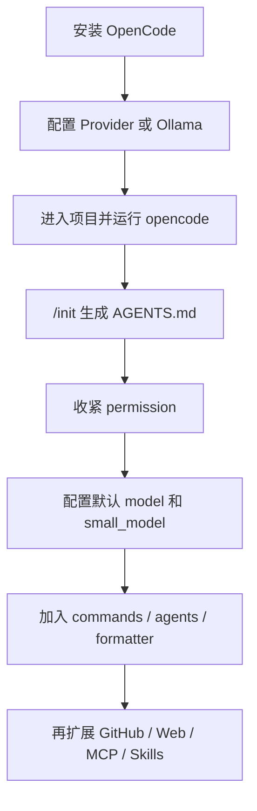

---
tags:
  - opencode
  - ai-coding-agent
  - ollama
  - local-llm
  - developer-tools
  - automation
---
# OpenCode 安装、配置、命令与最佳实践

面向终端 AI coding agent、工程自动化、团队协作和本地大模型接入场景，整理 OpenCode 的安装方式、配置体系、CLI 与 TUI 命令、自定义模型 API、Ollama 本地模型接入，以及从 0 到 1 的工程实践方法。

截至 `2026-04-26` 核对，本文主要依据 OpenCode 官方文档、官方 GitHub README 和 Ollama 官方 OpenCode 集成文档整理。

说明：

- 本文优先依据 OpenCode 官方文档与官方 GitHub README。
- 关于 `Ollama` 的部分，额外参考了 Ollama 官方集成文档，因为它提供了 OpenCode 本地模型接入的最新官方路径。
- 关于“最佳实践”的部分，凡是官方明确给出约束的，按官方整理；凡是工程方法论部分，则是在官方能力边界内做的实践型建议。

官方地址：

- GitHub：<https://github.com/anomalyco/opencode>
- Docs 首页：<https://opencode.ai/docs/>
- Intro / 安装：<https://opencode.ai/docs/>
- Config：<https://opencode.ai/docs/config/>
- CLI：<https://opencode.ai/docs/cli/>
- TUI：<https://opencode.ai/docs/tui/>
- Providers：<https://opencode.ai/docs/providers/>
- Models：<https://opencode.ai/docs/models/>
- Rules / `AGENTS.md`：<https://opencode.ai/docs/rules/>
- Agents：<https://opencode.ai/docs/agents/>
- Permissions：<https://opencode.ai/docs/permissions/>
- Commands：<https://opencode.ai/docs/commands/>
- Agent Skills：<https://opencode.ai/docs/skills/>
- Formatters：<https://opencode.ai/docs/formatters>
- Web：<https://opencode.ai/docs/web/>
- GitHub Agent：<https://opencode.ai/docs/github/>
- Share：<https://opencode.ai/docs/share/>
- Ollama 集成：<https://docs.ollama.com/integrations/opencode>

## 目录

- [Key Takeaways](#key-takeaways)
- [OpenCode 是什么](#opencode-是什么)
- [你最关心的问题先回答](#你最关心的问题先回答)
- [从 0 到 1 的推荐路径](#从-0-到-1-的推荐路径)
- [安装前准备](#安装前准备)
- [安装与升级](#安装与升级)
- [首次启动与基础使用](#首次启动与基础使用)
- [配置体系总览](#配置体系总览)
- [模型与 Provider 配置](#模型与-provider-配置)
- [自定义模型 API 配置](#自定义模型-api-配置)
- [本地 Ollama 配置](#本地-ollama-配置)
- [推荐基础配置](#推荐基础配置)
- [TUI / CLI / Web 的分工](#tui--cli--web-的分工)
- [Rules、AGENTS.md 与指令体系](#rulesagentsmd-与指令体系)
- [Agents、Permissions 与安全边界](#agentspermissions-与安全边界)
- [Commands、Skills、Formatters 与自动化](#commandsskillsformatters-与自动化)
- [命令速查表](#命令速查表)
- [工程实践最佳实践](#工程实践最佳实践)
- [如何最大程度发挥 OpenCode 的作用](#如何最大程度发挥-opencode-的作用)
- [常见坑](#常见坑)
- [参考来源](#参考来源)

## Key Takeaways

- `OpenCode` 当前官方定位是一个开源 AI coding agent，支持 `TUI`、`Web`、`Desktop` 和 `IDE extension`。
- 它不是绑定单一模型的平台；官方文档明确支持 `75+ providers`，也明确支持本地模型。
- 你要的“自定义模型 API”是官方支持项，不是 hack。OpenCode 官方当前明确支持 `OpenAI-compatible` provider。
- 你要的“本地 Ollama 模型”也是官方支持项，而且 Ollama 当前还有 `ollama launch opencode` 的官方集成方式。
- 工程上真正影响体验的不是“装没装上”，而是 6 件事：`Git 仓库`、`AGENTS.md`、`permission`、`custom commands`、`agents`、`formatter`。
- 如果是本地模型，当前最重要的现实问题不是“能不能连上”，而是 `上下文长度` 和 `tool calling` 稳定性。Ollama 官方 OpenCode 集成页当前建议至少 `64k` 上下文；OpenCode provider 文档同时提示如果工具调用异常，可先把 `num_ctx` 提到 `16k-32k` 以上。

## OpenCode 是什么

一句话理解：

- `OpenCode = 开源的终端 AI 编码代理 + 多模型 Provider 抽象层 + 可配置 Agent / Tool / Permission / Instruction 系统`

它和普通聊天式 AI 工具的区别在于，它不是只负责“回答”，而是完整地承担：

- 代码库阅读与搜索
- 文件修改与回滚
- shell 命令执行
- 子代理拆分任务
- Web / HTTP / IDE / GitHub 集成
- 自定义规则、命令、技能和插件

## 你最关心的问题先回答

### 1. OpenCode 能不能接自定义模型 API？

能。

OpenCode 官方当前明确支持：

- 内建 provider
- 自定义 `OpenAI-compatible` provider
- 自定义 `baseURL`
- 自定义 `headers`
- `apiKey` 从环境变量或文件注入

关键点：

- 如果你的 API 是 `OpenAI-compatible` 且走 `/v1/chat/completions`，优先用 `@ai-sdk/openai-compatible`
- 如果你的模型或网关走 `/v1/responses`，官方当前建议改用 `@ai-sdk/openai`

### 2. OpenCode 能不能接本地 Ollama 模型？

能，而且是官方支持项。

官方当前给了两种路径：

1. 直接在 `opencode.json` 里把 Ollama 当一个 `OpenAI-compatible` 本地 provider
2. 使用 Ollama 官方集成命令：

```bash
ollama launch opencode
```

### 3. OpenCode 适不适合工程实践？

适合，但前提是你把它当一个工程系统，而不是一个“高级聊天框”。

高价值做法是：

- 用 `Plan` 先分析
- 用 `Build` 再落代码
- 把规则固化到 `AGENTS.md`
- 把重复工作固化到 `.opencode/commands/`
- 把危险动作收紧到 `permission`
- 把格式统一交给 `formatter`

## 从 0 到 1 的推荐路径



推荐顺序：

1. 先装 CLI。
2. 先打通一个模型路径。
3. 先把 `Git + AGENTS.md + permission` 调整好。
4. 先把一两个项目用顺，再搞 Web、远程 server、MCP、GitHub agent。
5. 本地模型优先验证 `上下文长度 + 工具调用`，不要一上来就追求最低成本。

## 安装前准备

### 系统与前提

| 项目 | 建议 |
| --- | --- |
| 终端 | `WezTerm`、`Alacritty`、`Ghostty`、`Kitty` 等现代终端 |
| Provider 凭证 | 至少准备一个可用模型的 API key，或本地 Ollama |
| Windows | 官方推荐 `WSL`，优于原生 PowerShell |
| Git | 强烈建议项目本身是 Git 仓库 |

### 为什么 Git 很重要

OpenCode 的 `/undo`、`/redo`、snapshot 与很多回滚体验，本质上依赖 Git 风格的快照和变更跟踪。

这意味着：

- 非 Git 项目不是不能用
- 但可回滚、可审查、可追踪能力会明显差很多

### 关键目录

| 路径 | 作用 |
| --- | --- |
| `~/.config/opencode/opencode.json` | 全局主配置 |
| `~/.config/opencode/tui.json` | 全局 TUI 配置 |
| `~/.config/opencode/AGENTS.md` | 全局规则 |
| `~/.config/opencode/agents/` | 全局自定义 agent |
| `~/.config/opencode/commands/` | 全局自定义命令 |
| `~/.config/opencode/skills/` | 全局 skills |
| `~/.local/share/opencode/auth.json` | provider 登录凭证 |
| `<project>/opencode.json` | 项目配置 |
| `<project>/tui.json` | 项目 TUI 配置 |
| `<project>/AGENTS.md` | 项目规则 |
| `<project>/.opencode/` | 项目级 agents / commands / plugins / skills |

## 安装与升级

### 安装方式选择建议

| 方式 | 推荐度 | 典型命令 | 适用场景 |
| --- | --- | --- | --- |
| 官方安装脚本 | 最高 | `curl -fsSL https://opencode.ai/install \| bash` | 大多数个人开发机 |
| npm 全局安装 | 高 | `npm install -g opencode-ai` | 已有 Node 环境 |
| pnpm / bun / yarn | 高 | `pnpm install -g opencode-ai` 等 | 你已有对应包管理器 |
| Homebrew Tap | 高 | `brew install anomalyco/tap/opencode` | macOS / Linux，追新版本 |
| 官方 brew formula | 中 | `brew install opencode` | 只想用官方 formula，但更新更慢 |
| Windows 包管理器 | 高 | `choco install opencode` / `scoop install opencode` | Windows |
| Docker | 中 | `docker run -it --rm ghcr.io/anomalyco/opencode` | 临时体验、隔离运行 |
| Mise / Nix | 中 | `mise use -g github:anomalyco/opencode` 等 | 工具链统一管理 |

### 1. 官方安装脚本

```bash
curl -fsSL https://opencode.ai/install | bash
```

这是官方当前文档的首推方式。

### 2. Node 包管理器

```bash
npm install -g opencode-ai
```

```bash
pnpm install -g opencode-ai
```

```bash
bun install -g opencode-ai
```

```bash
yarn global add opencode-ai
```

### 3. Homebrew

官方当前更推荐自家的 tap：

```bash
brew install anomalyco/tap/opencode
```

说明：

- 这个 tap 更新更快
- `brew install opencode` 的官方 formula 由 Homebrew 团队维护，更新会更慢

### 4. Windows

```powershell
choco install opencode
```

```powershell
scoop install opencode
```

官方当前仍建议：

- 最佳体验优先 `WSL`

### 5. Docker

```bash
docker run -it --rm ghcr.io/anomalyco/opencode
```

适合：

- 临时体验
- 自动化容器环境
- 但不是最好的日常交互方式

### 6. 升级

```bash
opencode upgrade
```

升级到指定版本：

```bash
opencode upgrade v1.4.11
```

如果要显式指定安装方式：

```bash
opencode upgrade --method npm
```

### 7. 卸载

```bash
opencode uninstall
```

保留配置：

```bash
opencode uninstall --keep-config
```

## 首次启动与基础使用

### 第一次进项目

```bash
cd /path/to/project
opencode
```

进入 TUI 后，官方推荐第一步就是：

```text
/init
```

它会分析项目并创建或更新项目根目录的 `AGENTS.md`。

### 最常见的三种使用方式

| 方式 | 用法 | 最适合 |
| --- | --- | --- |
| TUI | `opencode` | 日常开发主入口 |
| 非交互 CLI | `opencode run "..."` | 脚本、自动化、单次任务 |
| Web | `opencode web` | 浏览器访问、远程访问 |

### TUI 三个核心交互

| 能力 | 写法 | 作用 |
| --- | --- | --- |
| 普通提问 | 直接输入文本 | 解释、实现、重构、计划 |
| 文件引用 | `@path/to/file.ts` | 把文件内容加入上下文 |
| shell 执行 | `!git status` | 直接执行命令并把输出返回上下文 |

### 推荐的第一轮操作

1. `/connect` 配一个 provider，或者先配好 `opencode.json`
2. `/models` 选模型
3. `/init` 生成 `AGENTS.md`
4. 跑一轮简单问题，例如“总结代码库结构”
5. 再用 `Plan` 模式做第一轮分析

## 配置体系总览

### 配置文件格式

OpenCode 支持：

- `JSON`
- `JSONC`

推荐用 `JSONC`，因为工程里很适合加注释。

示例：

```jsonc
{
  "$schema": "https://opencode.ai/config.json",
  "model": "anthropic/claude-sonnet-4-5",
  "autoupdate": true,
  "server": {
    "port": 4096
  }
}
```

### 配置来源与优先级

官方当前给出的优先级是：

1. Remote config：`.well-known/opencode`
2. Global config：`~/.config/opencode/opencode.json`
3. Custom config：`OPENCODE_CONFIG`
4. Project config：项目根目录 `opencode.json`
5. `.opencode` 目录：`agents/`、`commands/`、`plugins/` 等
6. Inline config：`OPENCODE_CONFIG_CONTENT`
7. Managed config files：系统管理目录
8. macOS MDM managed preferences：最高优先级

### 一个关键事实：配置是 merge，不是 replace

官方当前明确说明：

- 配置文件是“合并”，不是“整体替换”

这意味着最佳实践是：

- 全局配置放长期偏好
- 项目配置只写项目特有项
- 不要在项目里复制一整份全局配置

### TUI 配置是独立文件

全局：

```text
~/.config/opencode/tui.json
```

项目级：

```text
<project>/tui.json
```

说明：

- `opencode.json` 负责 server/runtime
- `tui.json` 负责界面、快捷键、滚动、主题等

### `.opencode` 目录的作用

官方当前说明 `.opencode` 与 `~/.config/opencode` 使用复数目录名：

- `agents/`
- `commands/`
- `modes/`
- `plugins/`
- `skills/`
- `tools/`
- `themes/`

旧的单数目录名仍兼容，但不建议再新建。

## 模型与 Provider 配置

### 两种接入方式

| 方式 | 入口 | 适合谁 |
| --- | --- | --- |
| TUI `/connect` | 交互式添加凭证 | 新手、手工使用 |
| `opencode auth login` | CLI 登录 provider | 自动化、脚本化、偏终端用户 |

官方当前说明，provider 凭证默认存放在：

```text
~/.local/share/opencode/auth.json
```

### 模型选择

TUI 内：

```text
/models
```

CLI：

```bash
opencode models
opencode models openai
opencode models --refresh
opencode models --verbose
```

### 官方当前列出的推荐模型

在 `Models` 文档里，OpenCode 当前列出的“适合 OpenCode”的模型包括：

- `GPT 5.2`
- `GPT 5.1 Codex`
- `Claude Opus 4.5`
- `Claude Sonnet 4.5`
- `Minimax M2.1`
- `Gemini 3 Pro`

### 推荐模型策略

#### 云端主力

| 场景 | 建议 |
| --- | --- |
| 主力实现 | 选强代码 + 强工具调用模型 |
| 轻量任务 | 配 `small_model` 给标题、轻任务、摘要 |
| 复杂推理 | 用高 reasoning variant |

#### 本地模型

| 条件 | 建议 |
| --- | --- |
| 必须支持工具调用 | 否则 agent 价值会打折 |
| 上下文要足够大 | 优先 `64k`，不要太小 |
| 代码能力优先 | 优先 coder / reasoning 导向模型 |
| 不要只看单轮聊天效果 | 要看多轮 + 文件修改 + 工具调用稳定性 |

### `model` 与 `small_model`

官方当前支持：

```jsonc
{
  "$schema": "https://opencode.ai/config.json",
  "model": "anthropic/claude-sonnet-4-5",
  "small_model": "anthropic/claude-haiku-4-5"
}
```

最佳实践：

- `model` 放主力编码模型
- `small_model` 放便宜、快、够稳的轻量模型

### Model Variants

OpenCode 当前支持 variants。

官方当前文档给出的大致内建变体：

| Provider | 常见 variants |
| --- | --- |
| OpenAI | `none`、`minimal`、`low`、`medium`、`high`、`xhigh` |
| Anthropic | `high`、`max` |
| Google | `low`、`high` |

这很适合做两种模式：

- `fast`：低推理、低成本
- `thinking`：高推理、重分析

## 自定义模型 API 配置

这是你这个需求里最关键的一部分。

### 1. 自定义 Provider 的官方路径

OpenCode 官方当前明确给出自定义 `OpenAI-compatible` provider 的流程：

1. 在 TUI 里执行 `/connect`
2. 选择 `Other`
3. 输入 provider id
4. 录入 API key
5. 在 `opencode.json` 中补 provider 配置
6. 再用 `/models` 选择模型

CLI 等价动作：

```bash
opencode auth login
```

### 2. 最小可用示例

```jsonc
{
  "$schema": "https://opencode.ai/config.json",
  "provider": {
    "myprovider": {
      "npm": "@ai-sdk/openai-compatible",
      "name": "My Provider",
      "options": {
        "baseURL": "https://api.myprovider.com/v1"
      },
      "models": {
        "my-model-name": {
          "name": "My Model"
        }
      }
    }
  }
}
```

### 3. 带 API key 与 headers 的生产写法

```jsonc
{
  "$schema": "https://opencode.ai/config.json",
  "provider": {
    "myprovider": {
      "npm": "@ai-sdk/openai-compatible",
      "name": "My Provider",
      "options": {
        "baseURL": "https://api.myprovider.com/v1",
        "apiKey": "{env:MYPROVIDER_API_KEY}",
        "headers": {
          "Authorization": "Bearer custom-token",
          "X-Client": "opencode"
        }
      },
      "models": {
        "my-model-name": {
          "name": "My Model"
        }
      }
    }
  },
  "model": "myprovider/my-model-name"
}
```

### 4. 何时用 `@ai-sdk/openai-compatible`，何时用 `@ai-sdk/openai`

这是当前自定义 provider 最容易写错的一点。

官方当前说明：

| 情况 | 建议 npm 包 |
| --- | --- |
| 兼容 `/v1/chat/completions` | `@ai-sdk/openai-compatible` |
| 兼容 `/v1/responses` | `@ai-sdk/openai` |

如果一个 provider 下面混用了两种协议，官方当前文档还提到：

- 可以按 model 覆盖 `provider.npm`

### 5. 最佳实践

| 原则 | 原因 |
| --- | --- |
| provider id 要和 `/connect` / `auth login` 里录入的一致 | 否则凭证对不上 |
| `baseURL` 一定写到 API 根路径 | 常见错误是缺 `/v1` |
| 优先用环境变量或 `{file:...}` 注入 key | 不要把密钥提交进 Git |
| 自定义 headers 只加必要项 | 头越多，兼容性风险越高 |
| 先用 `opencode models` 看模型是否被正确识别 | 这是最直接的验收 |

## 本地 Ollama 配置

### 1. 结论

OpenCode 官方当前明确支持本地 Ollama。

你有两种推荐方式：

1. `opencode.json` 手工配置
2. `ollama launch opencode`

### 2. 手工配置 Ollama Provider

官方当前给出的示例是：

```jsonc
{
  "$schema": "https://opencode.ai/config.json",
  "provider": {
    "ollama": {
      "npm": "@ai-sdk/openai-compatible",
      "name": "Ollama (local)",
      "options": {
        "baseURL": "http://localhost:11434/v1"
      },
      "models": {
        "llama2": {
          "name": "Llama 2"
        }
      }
    }
  }
}
```

注意：

- `models` 里的 key 必须改成你本地 Ollama 实际暴露的模型名
- 最稳妥的办法是先执行：

```bash
ollama ls
```

再把真实模型名填进去

### 3. 更实用的本地配置模板

```jsonc
{
  "$schema": "https://opencode.ai/config.json",
  "provider": {
    "ollama": {
      "npm": "@ai-sdk/openai-compatible",
      "name": "Ollama (local)",
      "options": {
        "baseURL": "http://localhost:11434/v1",
        "timeout": 600000,
        "chunkTimeout": 30000
      },
      "models": {
        "qwen3.5": {
          "name": "Qwen 3.5 Local"
        }
      }
    }
  },
  "model": "ollama/qwen3.5"
}
```

说明：

- `qwen3.5` 这里只是示意
- 你应该换成自己本地 `ollama ls` 看到的真实模型 ID

### 4. Ollama 官方的 OpenCode 快捷集成

Ollama 官方当前给出：

```bash
ollama launch opencode
```

只配置不启动：

```bash
ollama launch opencode --config
```

关键点：

- `ollama launch opencode` 会通过 `OPENCODE_CONFIG_CONTENT` 把配置注入 OpenCode
- OpenCode 启动时会对配置做 deep merge
- 你已有的 `~/.config/opencode/opencode.json` 仍然会被保留和生效
- 但只写在 `opencode.json` 里的 model，不一定会出现在 `ollama launch` 的模型选择菜单里

### 5. 上下文窗口与工具调用

这是本地模型能不能好用的关键。

两条官方信号需要一起看：

| 来源 | 当前建议 |
| --- | --- |
| Ollama 官方 OpenCode 集成页 | 推荐至少 `64k` 上下文 |
| OpenCode 官方 Providers 页 | 如果工具调用不工作，先把 `num_ctx` 提到 `16k-32k` 左右 |

工程上的理解：

- `16k-32k` 是最低可排障区间
- `64k` 更接近“本地 coding agent 真正常用”的下限

### 6. 本地 Ollama 的最佳实践

| 原则 | 建议 |
| --- | --- |
| 上下文优先 | 能给 `64k` 就给，不要太抠 |
| 先测工具调用 | 不要只测聊天 |
| 优先代码/推理向模型 | 只会闲聊的模型没什么价值 |
| 给长超时时间 | 本地模型慢是正常的 |
| 大任务先用 `Plan` | 减少直接写错的概率 |

### 7. LM Studio / llama.cpp 也可以

OpenCode 官方当前也给了本地 `LM Studio` 和 `llama.cpp` 的配置示例，底层思路一样：

- 都作为 `OpenAI-compatible` endpoint
- 填不同的 `baseURL`
- 把模型名写进 `models`

这意味着：

- 只要你的本地推理服务能提供兼容 OpenAI 的接口，OpenCode 一般都可以接

## 推荐基础配置

下面这份配置更适合作为“从 0 到 1”就能直接用的起点。

### 1. 全局 `opencode.jsonc`

```jsonc
{
  "$schema": "https://opencode.ai/config.json",

  "model": "myprovider/my-model-name",
  "small_model": "myprovider/my-small-model",

  "provider": {
    "myprovider": {
      "npm": "@ai-sdk/openai-compatible",
      "name": "My Provider",
      "options": {
        "baseURL": "https://api.myprovider.com/v1",
        "apiKey": "{env:MYPROVIDER_API_KEY}",
        "timeout": 600000,
        "chunkTimeout": 30000
      },
      "models": {
        "my-model-name": {
          "name": "My Main Model"
        },
        "my-small-model": {
          "name": "My Small Model"
        }
      }
    },

    "ollama": {
      "npm": "@ai-sdk/openai-compatible",
      "name": "Ollama (local)",
      "options": {
        "baseURL": "http://localhost:11434/v1",
        "timeout": 600000,
        "chunkTimeout": 30000
      },
      "models": {
        "qwen3.5": {
          "name": "Qwen 3.5 Local"
        }
      }
    }
  },

  "default_agent": "build",

  "permission": {
    "read": {
      "*": "allow",
      "*.env": "deny",
      "*.env.*": "deny",
      "*.env.example": "allow"
    },
    "edit": "ask",
    "bash": {
      "*": "ask",
      "git status*": "allow",
      "git diff*": "allow",
      "git log*": "allow",
      "grep *": "allow"
    },
    "webfetch": "ask",
    "external_directory": "ask"
  },

  "share": "manual",

  "compaction": {
    "auto": true,
    "prune": true,
    "reserved": 10000
  },

  "watcher": {
    "ignore": ["node_modules/**", "dist/**", ".git/**"]
  },

  "instructions": [
    "CONTRIBUTING.md",
    "docs/guidelines.md",
    ".cursor/rules/*.md"
  ]
}
```

### 2. 项目内切到本地模型

某个项目如果只想临时切本地 Ollama，可以在项目根目录再放一个 `opencode.json`：

```jsonc
{
  "$schema": "https://opencode.ai/config.json",
  "model": "ollama/qwen3.5"
}
```

因为 OpenCode 配置是 merge，所以这是非常干净的写法。

### 3. 全局 `tui.json`

```jsonc
{
  "$schema": "https://opencode.ai/tui.json",
  "theme": "opencode",
  "keybinds": {
    "leader": "ctrl+x"
  },
  "scroll_acceleration": {
    "enabled": true
  },
  "diff_style": "auto",
  "mouse": true
}
```

## TUI / CLI / Web 的分工

### 使用方式建议

| 入口 | 最适合干什么 | 不适合干什么 |
| --- | --- | --- |
| TUI | 日常开发、对话式改代码 | 长期远程访问 |
| `opencode run` | 自动化、脚本、批处理 | 持续深度交互 |
| `opencode serve` | API / headless backend | 直接给人交互 |
| `opencode web` | 浏览器访问、远程控制 | 暴露公网而不加密码 |
| `opencode attach` | TUI 连接远端/本地 server | 替代完整部署 |

### 高价值组合

最实用的组合之一：

1. 开一个常驻 server：

```bash
opencode serve
```

2. 再用非交互命令 attach 过去：

```bash
opencode run --attach http://localhost:4096 "Explain async/await in JavaScript"
```

这能减少每次 run 的冷启动成本，尤其是 MCP / provider 初始化比较重的时候。

## Rules、AGENTS.md 与指令体系

### 1. `AGENTS.md` 是 OpenCode 最关键的项目记忆入口

官方当前明确说明：

- 你可以通过 `AGENTS.md` 给 OpenCode 提供项目定制规则
- `/init` 会自动扫描项目并生成/更新它

### 2. 规则文件优先级

官方当前说明，OpenCode 启动时按这个顺序找 rules：

1. 当前目录向上遍历：`AGENTS.md`、`CLAUDE.md`
2. 全局：`~/.config/opencode/AGENTS.md`
3. Claude Code 兼容：`~/.claude/CLAUDE.md`

说明：

- OpenCode 支持 Claude Code 兼容回退
- 如果你已经有 `.claude/CLAUDE.md`，迁移成本很低

### 3. 什么时候用 `AGENTS.md`，什么时候用 `instructions`

| 场景 | 建议 |
| --- | --- |
| 项目长期规则 | `AGENTS.md` |
| 多文件规则聚合 | `instructions` |
| 想复用现有 `.cursor/rules`、`CONTRIBUTING.md` | `instructions` |
| 个人全局偏好 | `~/.config/opencode/AGENTS.md` |

### 4. `instructions` 示例

```jsonc
{
  "$schema": "https://opencode.ai/config.json",
  "instructions": [
    "CONTRIBUTING.md",
    "docs/guidelines.md",
    ".cursor/rules/*.md"
  ]
}
```

### 5. 一个够用的 `AGENTS.md` 模板

```md
# Project Rules

## Build and Test

- Install dependencies with `pnpm install`
- Run lint with `pnpm lint`
- Run tests with `pnpm test`
- For targeted validation, prefer package-level test commands before full-suite runs

## Architecture

- `apps/web` contains the frontend
- `packages/core` contains shared domain logic
- `packages/api` contains server handlers and data access

## Coding Conventions

- Use TypeScript strict mode
- Prefer existing utilities before introducing new abstractions
- Keep API contracts backward compatible unless explicitly changing them

## Change Workflow

- For larger tasks, start with analysis and an implementation plan
- After code changes, run the smallest relevant verification first
- Summarize impacted files and residual risks
```

### 6. 工程最佳实践

- 把 `/init` 生成的 `AGENTS.md` 提交进 Git
- 不要把 `AGENTS.md` 写成冗长人设文
- 优先写：构建命令、测试命令、目录结构、约束、坑点
- 不要把临时会议纪要和过期流程写进去

## Agents、Permissions 与安全边界

### 1. 当前内建 agents

官方当前说明 OpenCode 内建：

| Agent | 类型 | 作用 |
| --- | --- | --- |
| `build` | primary | 默认开发 agent，工具全开 |
| `plan` | primary | 分析与规划，限制修改 |
| `general` | subagent | 通用多步任务 |
| `explore` | subagent | 快速只读探索 |

### 2. 最佳实践分工

| Agent | 推荐用途 |
| --- | --- |
| `build` | 真正落代码、跑命令、改文件 |
| `plan` | 设计、分析、方案评估、陌生代码库探索 |
| `general` | 子任务并行处理 |
| `explore` | 快速 grep / glob / read-only 调查 |

### 3. `mode` 已经不是主入口

官方当前明确提示：

- `mode` 已弃用
- 现在通过 `agent` 配置来定义行为

### 4. 权限系统的核心逻辑

OpenCode 当前用 `permission` 控制：

- `"allow"`：自动执行
- `"ask"`：先询问
- `"deny"`：禁止

### 5. 为什么要改默认权限

官方当前说明：

- 默认是比较宽松的
- 大多数权限默认 `allow`
- `doom_loop` 和 `external_directory` 默认 `ask`

所以生产和工程实践里，强烈建议主动收紧。

### 6. 推荐权限模板

```jsonc
{
  "$schema": "https://opencode.ai/config.json",
  "permission": {
    "read": {
      "*": "allow",
      "*.env": "deny",
      "*.env.*": "deny",
      "*.env.example": "allow"
    },
    "edit": "ask",
    "bash": {
      "*": "ask",
      "git status*": "allow",
      "git diff*": "allow",
      "git log*": "allow",
      "grep *": "allow",
      "rm *": "deny"
    },
    "task": "ask",
    "webfetch": "ask",
    "websearch": "ask",
    "external_directory": {
      "~/projects/personal/**": "allow"
    }
  }
}
```

### 7. `tools` 配置已经过时

官方当前明确说明：

- `tools` 是 deprecated
- 新配置优先用 `permission`

### 8. 每个 agent 单独设权限

这很适合做：

- `review`：禁止 edit
- `docs`：允许 read / grep，禁止 bash
- `build`：允许 edit，但 bash 仍 ask

### 9. 自定义 agent 示例

#### JSON 方式

```jsonc
{
  "$schema": "https://opencode.ai/config.json",
  "agent": {
    "review": {
      "description": "Reviews code without making direct changes",
      "mode": "subagent",
      "temperature": 0.1,
      "permission": {
        "edit": "deny",
        "bash": "ask",
        "webfetch": "deny"
      }
    }
  }
}
```

#### Markdown 方式

路径：

```text
.opencode/agents/review.md
```

内容：

```md
---
description: Reviews code for quality and risks
mode: subagent
temperature: 0.1
permission:
  edit: deny
  bash:
    "*": ask
    "git diff*": allow
    "git log*": allow
    "grep *": allow
  webfetch: deny
---

Only analyze code and provide findings.
Focus on correctness, regressions, and missing tests.
```

## Commands、Skills、Formatters 与自动化

### 1. 自定义 Commands 是最高 ROI 的扩展点之一

官方当前支持两种定义方式：

- `opencode.json` 里的 `command`
- `.opencode/commands/*.md`

### 2. 一个高价值命令示例

路径：

```text
.opencode/commands/review-pr.md
```

```md
---
description: Review recent changes
agent: plan
subtask: true
---

Recent commits:
!`git log --oneline -10`

Review the recent changes and identify:
- possible regressions
- missing tests
- risky refactors
```

### 3. 命令模板支持的关键能力

| 能力 | 写法 |
| --- | --- |
| 所有参数 | `$ARGUMENTS` |
| 第一个参数 | `$1` |
| 第二个参数 | `$2` |
| 注入 shell 输出 | ``!`git log --oneline -10` `` |
| 注入文件内容 | `@src/foo.ts` |

### 4. Skills

官方当前支持 `SKILL.md` 形式的 Agent Skills。

支持的目录包括：

- `.opencode/skills/<name>/SKILL.md`
- `~/.config/opencode/skills/<name>/SKILL.md`
- `.claude/skills/...`
- `~/.claude/skills/...`
- `.agents/skills/...`
- `~/.agents/skills/...`

### 5. Skills 适合干什么

很适合固化这些高频工作：

- 发版流程
- 代码审查 checklist
- 文档生成规范
- 数据库迁移规范
- Monorepo 提交流程

### 6. 最小 Skill 示例

```md
---
name: git-release
description: Create consistent releases and changelogs
license: MIT
compatibility: opencode
---

## What I do

- Draft release notes from merged PRs
- Propose a version bump
- Provide a copy-pasteable release command
```

### 7. Formatters

OpenCode 会在写文件或编辑后自动按语言格式化。

内建 formatter 当前包括常见的：

- `prettier`
- `biome`
- `gofmt`
- `ruff`
- `clang-format`
- `ktlint`
- `rubocop`

### 8. Formatter 最佳实践

| 场景 | 建议 |
| --- | --- |
| 你项目已用 Prettier | 保持默认自动接管 |
| 你项目已用 Biome | 明确启用/保持 Biome |
| 你格式器链很复杂 | 自己配置 custom formatter |
| 大仓库多语言 | 不要手动格式化，交给 OpenCode |

### 9. 自定义 Formatter

```jsonc
{
  "$schema": "https://opencode.ai/config.json",
  "formatter": {
    "prettier": {
      "command": ["npx", "prettier", "--write", "$FILE"],
      "environment": {
        "NODE_ENV": "development"
      },
      "extensions": [".js", ".ts", ".jsx", ".tsx"]
    },
    "custom-markdown-formatter": {
      "command": ["deno", "fmt", "$FILE"],
      "extensions": [".md"]
    }
  }
}
```

### 10. GitHub Agent

如果你想把 OpenCode 用进 issue / PR 流程，官方当前支持：

```bash
opencode github install
```

使用场景：

- issue triage
- 自动修复并发 PR
- 在 GitHub Actions runner 内安全执行

## 命令速查表

### CLI 核心命令

| 命令 | 用途 | 常见场景 | 备注 |
| --- | --- | --- | --- |
| `opencode` | 启动 TUI | 日常主入口 | 默认当前目录 |
| `opencode /path/to/project` | 打开指定项目 | 切项目 |  |
| `opencode run "..."` | 非交互执行 | 自动化、脚本 | 高价值 |
| `opencode serve` | 启动 headless server | API / backend | 可配密码 |
| `opencode web` | 启动 Web UI | 浏览器使用 | 可远程访问 |
| `opencode attach <url>` | 连接运行中的 backend | 远程 / 本地共享状态 |  |
| `opencode upgrade` | 升级 OpenCode | 日常维护 |  |
| `opencode uninstall` | 卸载 | 清理环境 | 支持保留配置 |

### CLI 命令详表

| 命令 | 作用 | 关键参数 | 备注 |
| --- | --- | --- | --- |
| `opencode [project]` | 启动 TUI | `--continue` `--session` `--fork` `--prompt` `--model` `--agent` | 日常开发 |
| `opencode run [message..]` | 非交互模式 | `-m` `--agent` `-f` `--format json` `--attach` `--share` | 脚本与 CI 很有用 |
| `opencode models [provider]` | 列模型 | `--refresh` `--verbose` | 配 provider 后先跑 |
| `opencode auth login` | 登录 provider | 无 | 写入 `auth.json` |
| `opencode auth list` | 看已登录 provider | 无 | `opencode auth ls` |
| `opencode auth logout` | 清凭证 | 无 |  |
| `opencode agent create` | 创建 agent | 无 | 交互式 |
| `opencode agent list` | 列 agent | 无 |  |
| `opencode mcp add` | 添加 MCP server | 无 | 交互式 |
| `opencode mcp list` | 查看 MCP server | 无 | `opencode mcp ls` |
| `opencode mcp auth [name]` | 认证 MCP OAuth | 无 |  |
| `opencode mcp logout [name]` | 清 MCP OAuth | 无 |  |
| `opencode mcp debug <name>` | 调 MCP OAuth | 无 |  |
| `opencode github install` | 安装 GitHub agent | 无 | GitHub Actions 场景 |
| `opencode github run` | 运行 GitHub agent | `--event` `--token` | Actions 内用 |
| `opencode session list` | 列 session | `-n` `--format json` | 会话管理 |
| `opencode stats` | 查看 token/cost | `--days` `--tools` `--models` `--project` | 成本治理 |
| `opencode export [sessionID]` | 导出会话 JSON | 无 | 迁移/备份 |
| `opencode import <file|url>` | 导入会话 | 无 | 支持 share URL |
| `opencode web` | 启动 Web UI | `--port` `--hostname` `--mdns` `--cors` | 远程时要加密码 |
| `opencode serve` | 启动 HTTP server | `--port` `--hostname` `--mdns` `--cors` | 适合 API 使用 |
| `opencode acp` | 启动 ACP server | `--cwd` `--port` `--hostname` | 高级集成 |
| `opencode uninstall` | 卸载 | `-c` `-d` `--dry-run` `-f` | 注意数据保留 |

### TUI 斜杠命令

| 命令 | 别名/快捷键 | 用途 | 备注 |
| --- | --- | --- | --- |
| `/connect` | 无 | 添加 provider | 新手必会 |
| `/models` | `ctrl+x m` | 选择模型 |  |
| `/init` | `ctrl+x i` | 创建/更新 `AGENTS.md` | 项目初始化关键 |
| `/compact` | `/summarize` `ctrl+x c` | 压缩上下文 | 长会话常用 |
| `/details` | `ctrl+x d` | 切换工具执行细节 | 调试时很有用 |
| `/editor` | `ctrl+x e` | 用外部编辑器写消息 | 长 prompt 很好用 |
| `/export` | `ctrl+x x` | 导出当前会话到 Markdown | 归档 |
| `/sessions` | `/resume` `/continue` `ctrl+x l` | 切换会话 |  |
| `/new` | `/clear` `ctrl+x n` | 新会话 |  |
| `/undo` | `ctrl+x u` | 回滚上一步与文件改动 | Git 仓库效果最佳 |
| `/redo` | `ctrl+x r` | 恢复刚回滚的内容 |  |
| `/share` | `ctrl+x s` | 分享当前会话 | 公开链接 |
| `/unshare` | 无 | 取消分享 |  |
| `/themes` | `ctrl+x t` | 切换主题 |  |
| `/thinking` | 无 | 显示/隐藏 reasoning blocks | 仅显示开关 |
| `/help` | `ctrl+x h` | 帮助 |  |
| `/exit` | `/quit` `/q` `ctrl+x q` | 退出 |  |

### 最值得记住的 TUI 交互

| 写法 | 作用 |
| --- | --- |
| `@file.ts` | 引入文件内容 |
| `!git status` | 执行 shell 并把输出加入上下文 |
| `Tab` | 在 primary agents 间切换 |
| `@general ...` | 手动调用子代理 |
| `ctrl+t` | 切换模型 variant |

### Web / Serve 相关命令

| 命令 | 用途 | 最佳实践 |
| --- | --- | --- |
| `opencode web` | 启动 Web UI | 本机可裸跑，远程必须加密码 |
| `opencode web --hostname 0.0.0.0 --port 4096` | 局域网访问 | 搭配 `OPENCODE_SERVER_PASSWORD` |
| `opencode web --mdns` | 局域网发现 | 多设备临时访问 |
| `opencode serve` | Headless API server | 脚本、前后端集成 |
| `opencode attach http://host:4096` | TUI 连到 server | 共享同一 backend |

## 工程实践最佳实践

### 1. 永远先把项目变成 Git 仓库

原因：

- `/undo`、`/redo`、snapshot、回滚链条都依赖它

### 2. 先用 `Plan`，再用 `Build`

这是 OpenCode 里最稳的一种工作流。

推荐节奏：

1. `Plan` 分析任务
2. 让它列出改动面与验证方案
3. 你补充约束
4. 切 `Build` 再落代码

### 3. `AGENTS.md` 只写长期有效规则

应该写：

- build / test / lint 命令
- 目录结构
- 项目约束
- 常见坑

不该写：

- 这周临时任务
- 已过期流程
- 过多人格化文本

### 4. 默认把 `edit` 和 `bash` 收紧到 `ask`

OpenCode 默认比较宽松。

工程实践里更稳的策略是：

- `read` 默认 allow
- `edit` ask
- `bash` ask
- 再对白名单命令做 allow

### 5. 把重复动作做成 `commands`

优先固化这些流程：

- `/test`
- `/review-changes`
- `/fix-lint`
- `/summarize-pr`
- `/prepare-release`

### 6. 用 `small_model` 降低轻任务成本

不要让最贵模型去做：

- 标题生成
- 会话摘要
- 简单结构化输出

### 7. 大仓库注意 snapshot 和 watcher

官方当前明确提到：

- snapshot 默认开启
- 大仓库或带很多 submodules 时，可能带来索引慢和磁盘占用

因此：

- 超大仓库可以考虑：

```jsonc
{
  "snapshot": false
}
```

- 同时用 `watcher.ignore` 排除 `node_modules`、`dist`、`.git`

### 8. 自动格式化交给 OpenCode

不要让 agent 每次“顺手手工调格式”。

正确做法：

- 让项目原生 formatter 发挥作用
- 必要时明确定义 custom formatter

### 9. 非交互批处理优先 `run --attach`

原因：

- 避免每次冷启动
- 特别适合 MCP / provider 初始化较重的环境

### 10. Web / Server 暴露网络时必须上密码

官方当前明确说明：

- 如果不设置 `OPENCODE_SERVER_PASSWORD`，本机使用还好
- 但网络访问时就是不安全

### 11. 分享默认保持 `manual`

官方当前默认就是 `manual`，这是对的。

因为：

- 共享链接是公开可访问的

## 如何最大程度发挥 OpenCode 的作用

### 1. 把它当“编码工作台”，不是聊天工具

正确心智模型：

- `TUI` 是主交互层
- `AGENTS.md` 是项目脑
- `commands` 是流程模板
- `agents` 是角色分工
- `permissions` 是安全护栏
- `formatter` 是落地一致性

### 2. 做出分层模型策略

很推荐这套分工：

| 层次 | 模型策略 |
| --- | --- |
| 主实现 | 强推理、强工具调用模型 |
| 轻任务 | `small_model` |
| 本地低成本 | `ollama/*` |
| 敏感代码/离线环境 | 全本地 provider |

### 3. 把它纳入日常 GitHub 流程

高价值使用：

- issue triage
- PR review 辅助
- 自动实现简单需求
- 生成会话分享链接辅助协作

### 4. 给每个团队约束沉淀一个 `AGENTS.md`

这是团队协作里最划算的投入之一。

收益：

- 每个新 session 少解释一次
- 每个新人少重复一次口头知识

### 5. 用 `commands + agents` 做专项助手

例如：

- `review` agent：只做 review
- `docs` agent：只做文档
- `security` agent：只查风险
- `/test`、`/release`、`/migration-review`：固化团队流程

### 6. 本地模型别只拿来“省钱”

本地模型真正高价值的场景是：

- 内网或敏感代码环境
- 离线开发
- 批量机械性任务
- 轻量探索与补全式工作

如果是：

- 大规模重构
- 多轮复杂 agentic 修改
- 大型代码库高质量理解

通常仍建议保留一个强云模型。

### 7. 一个我最推荐的长期组合

1. 全局配置里同时定义：
   `cloud provider + ollama`
2. 日常默认走强云模型
3. 某些项目单独用项目级 `opencode.json` 切到 `ollama/*`
4. 用 `Plan` 和自定义 `review` 子代理降低误改风险
5. 用 `run --attach` 和 `GitHub agent` 连接自动化场景

## 常见坑

### 1. 把 OpenCode 当成“更好看的聊天框”

这样会浪费掉：

- `AGENTS.md`
- `commands`
- `permission`
- `agents`
- `formatter`

### 2. 不在 Git 仓库里用 `/undo`

结果通常是：

- 回滚体验不稳定
- 你以为可以撤回，其实不完整

### 3. 自定义 provider 的 `id` 对不上

典型错误：

- `/connect` 里录的是 `myprovider`
- `opencode.json` 里写成了 `my-provider`

结果：

- 凭证不生效

### 4. 用错 npm provider 包

这在自定义 API 接入里很常见。

记法：

- `/v1/chat/completions` -> `@ai-sdk/openai-compatible`
- `/v1/responses` -> `@ai-sdk/openai`

### 5. 本地模型上下文太小

后果：

- 工具调用莫名其妙失败
- 多文件任务明显变笨
- 计划和实现质量波动很大

### 6. 本地模型只测对话，不测工具

这是最典型的误判来源。

要测的至少包括：

- 读文件
- 改文件
- 跑命令
- 多轮上下文

### 7. 把 Web / Serve 暴露到网络但没设密码

风险非常直接。

至少要：

```bash
OPENCODE_SERVER_PASSWORD=replace-me opencode web --hostname 0.0.0.0 --port 4096
```

### 8. 把密钥写进项目 `opencode.json`

正确做法：

- 用 `{env:...}`
- 或 `{file:...}`

### 9. 过度膨胀 `AGENTS.md`

过长、过杂、过时，都会让它越来越没用。

### 10. 一上来就把所有权限放开

尤其不要把：

- `bash`
- `edit`
- `external_directory`
- `webfetch`

全设成裸 `allow` 后再指望人工补救。

## 参考来源

### OpenCode 官方

- Intro：<https://opencode.ai/docs/>
- Config：<https://opencode.ai/docs/config/>
- CLI：<https://opencode.ai/docs/cli/>
- TUI：<https://opencode.ai/docs/tui/>
- Providers：<https://opencode.ai/docs/providers/>
- Models：<https://opencode.ai/docs/models/>
- Rules：<https://opencode.ai/docs/rules/>
- Agents：<https://opencode.ai/docs/agents/>
- Permissions：<https://opencode.ai/docs/permissions/>
- Commands：<https://opencode.ai/docs/commands/>
- Skills：<https://opencode.ai/docs/skills/>
- Formatters：<https://opencode.ai/docs/formatters>
- Web：<https://opencode.ai/docs/web/>
- GitHub：<https://opencode.ai/docs/github/>
- Share：<https://opencode.ai/docs/share/>

### GitHub

- README：<https://github.com/anomalyco/opencode>

### Ollama 官方

- OpenCode 集成：<https://docs.ollama.com/integrations/opencode>
- CLI：<https://docs.ollama.com/cli>
