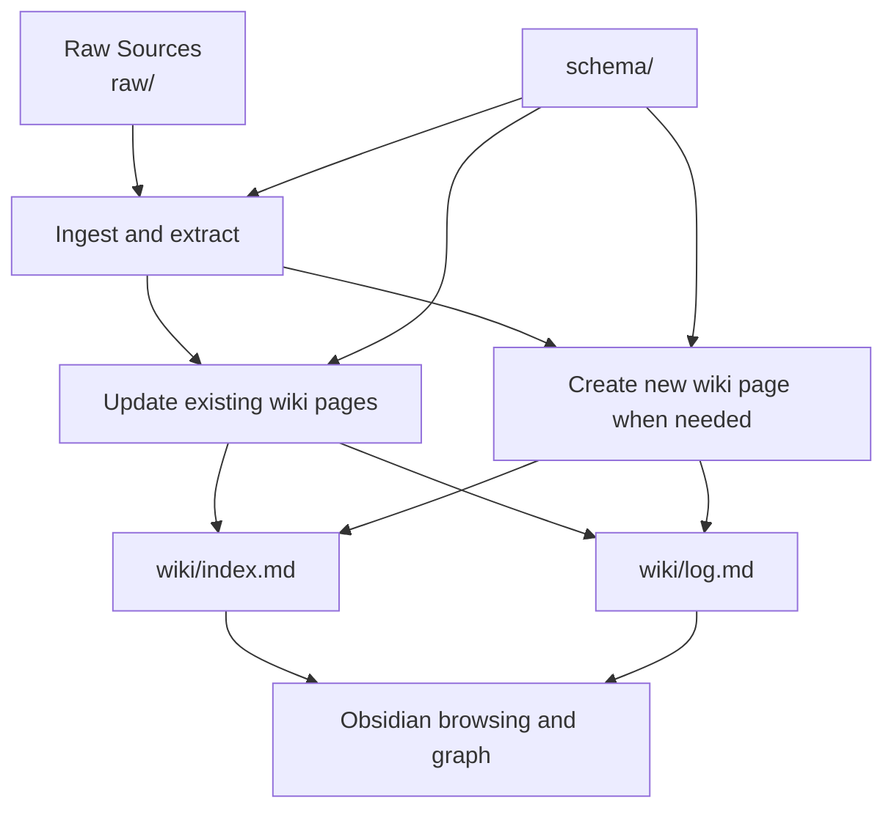

# Karpathy LLM Wiki / Knowledge Base 方法

[TOC]

Karpathy 这套方法的核心不是“临时检索”，而是把原始资料持续编译成可维护的知识网络。

## Key Takeaways

- `raw/` 保存证据，`wiki/` 保存编译后的知识页，`schema/` 负责治理规则。
- 这套方法的核心是长期维护的 compiled wiki，而不是一次性检索结果。
- 对已有明显一级分类的 Obsidian vault，更适合用“全局控制面 + 分域知识面”的混合结构。
- `note-curator` 适合负责单页整理，`llm-wiki-curator` 适合负责整个知识库的 ingest、routing 和 lint。

## Overview

Andrej Karpathy 提出的这套方法，不是把资料一次性塞进上下文，也不是传统意义上“每问一次就检索一次”的 RAG。它更像一个持续运行的知识编译器：把原始资料放进 `raw/`，由 LLM 抽取、整理、归纳，再沉淀为可维护的 `wiki/` 页面，并通过 `schema/` 约束命名、结构和维护规则。

它的关键价值在于：知识不是临时回答，而是会变成一个能长期增长、持续自我整理、可以被 Obsidian 浏览的个人知识库。

## Key Concepts

### 1. `raw/` 是证据层

- 存放原始资料，保持只读。
- 资料类型可以是博客、论文、PDF、代码库、截图、会议纪要、已有笔记。
- 这个目录的目标不是“好读”，而是“可追溯”。

### 2. `wiki/` 是知识层

- 这里放的是 LLM 编译后的知识页面。
- 每一页应该围绕一个稳定主题、概念、项目、人物或问题。
- 页面之间通过 wikilink、索引页、反向链接形成网络。

### 3. `schema/` 是治理层

- 这里定义目录约定、页面粒度、命名方式、常用模板、维护规则。
- 它相当于告诉代理“这个知识库应该怎么长、怎么改、怎么保持整洁”。

### 4. 日常循环是 ingest / query / lint

- ingest: 导入新资料，更新相关 wiki 页。
- query: 先读 wiki 回答问题，再把有长期价值的答案回写到 wiki。
- lint: 定期检查坏链接、重复页面、孤儿页面、缺失来源、过时结论。

## Comparison Table

| 维度 | LLM Wiki / Knowledge Base | 传统一次性检索 / 临时问答 |
| --- | --- | --- |
| 原始资料位置 | 固定沉淀在 `raw/` | 往往散落或只在当次检索中出现 |
| LLM 工作方式 | 持续编译和维护 | 临时读取并即时回答 |
| 输出形态 | 持久化 Markdown Wiki | 一次性回复 |
| 知识积累 | 会不断增长与重构 | 容易丢失在聊天记录里 |
| 导航方式 | index、wikilink、graph view | 搜索结果或会话滚动 |
| 适合场景 | 长期个人知识库、研究库、项目档案 | 临时问题、快速查找 |

## Architecture or Flow

## Principles and Mechanisms

### 编译优先，而不是检索优先

这套方法的重点不是“如何更快找到原文”，而是“如何把原文变成更高质量的长期知识表示”。原文仍然保留在 `raw/`，但日常阅读和问答尽量基于 `wiki/` 进行。

### 优先更新旧页，而不是无脑增页

如果新资料只是补充已有主题，优先更新已有页面，避免产生大量语义重叠的笔记。这样知识会越来越密，而不是越来越散。

### 把聊天中的高价值结论回写进 wiki

很多真正有价值的解释和判断，往往出现在与 LLM 的对话里。如果这些内容只停留在聊天窗口，就无法积累。这个方法要求把 durable answers 回写为正式页面或补丁。

### 用 schema 约束知识库的“生长方式”

没有 schema，知识库会很快退化成另一个大杂烩目录。schema 的作用不是增加负担，而是保证页面粒度、命名和交叉链接一直可控。

## Practical Usage

### 对个人笔记库的落地方式

1. 新资料进入 `raw/`
2. LLM 读取资料，判断应该更新哪个主题页
3. 按 `note-curator` 风格输出结构化页面
4. 更新 `wiki/index.md`
5. 在 `wiki/log.md` 记录一次 ingest
6. 周期性执行 lint，修复坏链接和孤儿页

### 与 `note-curator` 的关系

`note-curator` 适合做“单页输出质量控制”，例如：

- 重组结构
- 增补对比表
- 增补 Mermaid 图
- 统一术语
- 标记待确认信息

而这套 `LLM Wiki` 方法更像是“知识库编排层”：

- 决定资料进哪里
- 决定页面要更新还是新建
- 决定索引和链接如何维护
- 决定何时做 lint 和重构

两者组合时，比较自然的分工是：

- `llm-wiki-curator` 负责知识库生命周期
- `note-curator` 负责单个 wiki 页面的高质量 Markdown 成形

## Pitfalls and Best Practices

### 常见问题

- 把 `raw/` 当成普通笔记目录来改写，导致来源层失真。
- 每次导入都新建页面，最后出现大量重复概念。
- 只有页面，没有索引页和日志页，导致后续越来越难导航。
- 回答问题后不回写，知识仍然停留在聊天记录里。

### 实践建议

- 先从少量主题做起，不要一开始就批量导入整个库。
- 每个页面只解决一个清晰主题，避免“大而全”。
- 优先维护高频访问页面，让 wiki 的核心骨架先变得稳定。
- 每次 ingest 后都顺手更新索引，这比事后补救便宜很多。

## Related Pages

- [[index]]

## 参考来源

- [Karpathy LLM wiki gist](https://gist.github.com/karpathy/442a6bf555914893e9891c11519de94f)
- [Raw source record](../raw/karpathy-llm-wiki-gist-source.md)
