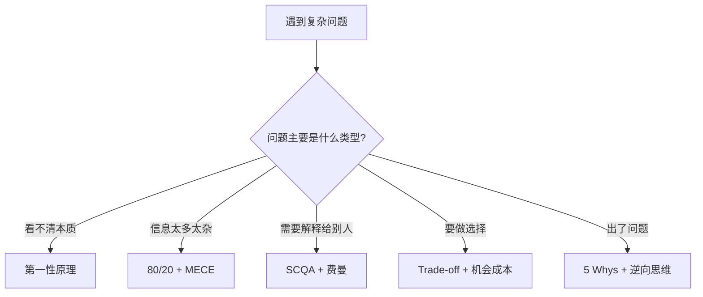

# 高杠杆思维模型

> 思维模型不是聪明话术，而是帮助你更稳定地理解、拆解、表达和解决问题的认知工具。真正有价值的模型满足三个条件：适用频率高、迁移能力强、能改变行动质量。

## 核心要点

1. 最高优先级的模型不是最多，而是最常被复用：**第一性原理、MECE、费曼学习法、80/20、刻意练习、SCQA、Trade-off**
2. 学习新知识时：先用 80/20 找主干 → 费曼学习法检验理解 → 刻意练习 + 反馈闭环变成能力
3. 做方案和汇报时：先 SCQA 组织叙事 → MECE 拆结构 → Trade-off 解释为什么这么选
4. 排查问题时：先收集事实 → 5 Whys 找根因 → 逆向思维补防线
5. 做长期决策时：必须同时看机会成本、二阶影响、概率与期望值
6. 奥卡姆剃刀适合减少不必要解释，但不能代替证据；简单解释不是自动正确
7. 模型必须落到动作、判断或产出上。不能改变行动的模型只是漂亮名词

## 是什么

思维模型是对反复出现的认知问题的抽象解决方案。本质上是"问题处理器"——先识别问题类型（学习、表达、拆解、选择、排障、决策、迭代），然后从模型库中选取 1-3 个组合使用。

## 怎么用

### 模型优先级总览

| 优先级 | 模型 | 解决什么问题 | 最适合场景 |
|--------|------|-------------|-----------|
| P0 | 第一性原理 | 穿透表象回到底层约束 | 学新领域、重构方案 |
| P0 | MECE 原则 | 避免遗漏和重复 | 拆需求、写方案、排查 |
| P0 | 费曼学习法 | 检验是否真正理解 | 学习新概念、跨领域迁移 |
| P0 | 80/20 法则 | 从海量信息抓重点 | 学习路线、任务优先级 |
| P0 | 刻意练习与反馈闭环 | 把知道变成会做 | 技能提升、编码、表达 |
| P1 | SCQA 核心叙事 | 让复杂问题易理解 | 汇报、方案背景、沟通 |
| P1 | Trade-off 权衡矩阵 | 解释选择而非只给结论 | 技术选型、架构取舍 |
| P1 | 5 Whys 根因分析 | 避免停在表层原因 | 故障排查、质量问题 |
| P1 | 逆向思维/事前验尸 | 提前发现失败路径 | 风险评估、上线前检查 |
| P1 | 二阶思考/系统思考 | 看到长期和连锁影响 | 职业选择、产品策略 |

### 模型选择流程

### 组合打法

| 场景 | 推荐组合 | 产出 |
|------|---------|------|
| 学习新领域 | 80/20 → 费曼 → 刻意练习 | 知识地图 + 白话笔记 + 练习记录 |
| 做技术方案 | MECE → Trade-off → SCQA | 分类框架 + 方案对比表 + 汇报叙事 |
| 排查线上问题 | 5 Whys → 逆向思维 → 第一性原理 | 根因链路 + 防线清单 |
| 长期决策 | 机会成本 + 二阶思考 + 概率思维 | 长期影响分析 + 取舍说明 |

## 关联

- [[费曼学习法]] — 本体系中 P0 级模型，检验理解的最高效方法
- [[刻意练习与反馈闭环]] — 本体系中 P0 级模型，知识→能力的转化器
- [[SCQA 核心叙事]] — 本体系中 P1 级模型，复杂信息的结构化表达框架

## 参考来源

- 详见完整笔记：[[高杠杆思维模型实战手册]]
- Charlie Munger: "A Latticework of Mental Models"
- Farnam Street: The Great Mental Models 系列

## 开放问题

- 如何量化和追踪思维模型的使用效果？
- 新的 AI 协作场景下，哪些模型需要调整或新增？
