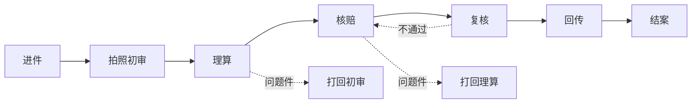

# 案件生命周期流程设计

> 一个理赔案件从进入系统到最终结案的完整状态流转和关键节点设计。核心挑战：多进件方式、多流程类型、多异常分支的统一建模。

## 核心决策

1. 案件生命周期采用**节点流转模式**而非状态机模式——每个案件位于唯一节点，节点内有子状态
2. 进件方式（API/手动/批量）和流程类型（普通/加急/简化）在进件时确定，影响后续节点路径
3. 异常流程（打回/恢复/回退）设计为节点的反向流转，保留完整操作记录而非覆盖
4. 资金操作（冻结/解冻/打款/回传）与案件状态解耦——资金状态独立于案件状态
5. 票据风控在理算节点作为前置校验，不通过则阻塞后续流转

## 背景与约束

- 对接多家保司，每家进件方式和对接收口不同（API 推送、手动上传、FTP 批量）
- 业务流程包括：拍照初审 → 理算 → 核赔 → 复核 → 回传 → 结案
- 不可变约束：监管要求全流程可审计；资金操作需双人复核；票据必须可追溯

## 概念模型

核心实体关系：

```
进件(Claim) ──1:N──> 案件(Case) ──1:N──> 节点流转记录(NodeLog)
                       │
                       ├──1:N──> 票据(Invoice) ── 风控标记
                       ├──1:N──> 资金操作(FundOp)
                       └──1:N──> 问题件(Issue)
```

- **进件(Claim)**：外部入口，包含原始数据和接入方式
- **案件(Case)**：系统内部工作单元，有唯一 case_id
- **节点(Node)**：流程阶段（初审/理算/核赔/复核/回传/结案）
- **问题件(Issue)**：阻塞当前节点的异常，需要人工介入

## 流程



## 关键权衡

| 决策点 | 方案 A | 方案 B | 选择 | 原因 |
|--------|--------|--------|------|------|
| 流转模型 | 状态机（平级状态切换） | 节点流转（有序阶段） | 节点流转 | 业务阶段有序、不可跳级 |
| 异常处理 | 状态回退 | 反向流转+日志 | 反向流转+日志 | 审计要求完整操作记录 |
| 资金与案件关系 | 资金状态嵌入案件状态 | 资金独立状态 | 资金独立 | 解耦后两边可独立演进 |
| 票据风控时机 | 结案时批量检查 | 理算时前置校验 | 理算时前置 | 早发现早处理，减少返工 |

## 边界与例外

- **免审核案件**：低于阈值金额的案件跳过核赔节点，直接进入复核
- **紧急通道**：标记为紧急的案件可并行处理（初审+理算同时进行）
- **跨保司案件**：涉及多保司分账的案件，在结案前增加分账确认节点
- **票据补传**：结案后允许补传票据，但触发重新核赔

## 关联文档

- [[案件的理算设计]] — 理算节点的详细计算逻辑
- [[票据风控专题：废票、假票、未查验票、红冲票、重复票、忽略重复、风险提示之间的关系|票据风控专题]] — 票据风控 7 种异常类型的完整处理
- [[资金与结算专题：冻结、解冻、打款、回传、回销、返还票据、挂账、结算状态|资金与结算专题]] — 资金冻结、解冻、打款、回传的完整设计
- [[问题件、打回、恢复与回退手册]] — 异常流程操作手册
- [[案件排查与诊断手册]] — 线上问题定位方法论

## 参考来源

- 完整设计文档：[[案件生命周期以及流程]]
- [[案件生产系统的全过程]]
- [[进件方式、流程类型与对接模式差异]]

## 开放问题

- 节点流转是否支持动态新增节点类型（如未来第三方审核节点）？
- 案件超时自动流转的策略如何设计？
